


## Предисловие

Попытка сравнить производительность процессоров на разнородных архитектурах x86-64, e2k (Эльбрус), mips и arm.
Все тесты написаны на языке C (взяты из исходных кодов, которые я не модифицировал и не оптимизировал) и компилируются под конкретную архитектуру с использованием конкретного компилятора для данной архитектуры и тесты производятся на различных дистрибутивах операционных систем на ядре Linux. На результаты может влиять как тип так и версия компилятора, а также режим оптимизаций. Хотя даже таким способом можно примерно сравнить производительность процессоров на разных архитектурах.

P.S.: Знаю, что большинство тестов для очень старых компьютеров, но они работают везде. Что даже очень неплохо.

## Типы архитектур сравниваемых процессоров

### CISC

CISC (Complex instruction set computing) - архитектура, в которой небольшой набор регистров, команды различной длинны, операции кодируются одной командой.

### RISC

RISC (Reduced instruction set computing) - процессорная архитектура, в которой инструкции упрощены и имеют фиксированную длину (например, 32 бита), что позволяет повысить производительность. Имеет большое число регистров.

### VLIW

VLIW (very long instruction word) - архитектура процессоров с очень большой инструкцией. Одна инструкция содержит в себе много простых инструкций, которые могут исполняться разными блоками процессора. Всё это сильно упрощает архитектуру, но усложняет компилятор. Неэффективный код может порождать не полностью заполненные инструкции, что сильно снижает производительность программы.

## Описание архитектур сравниваемых процессоров

### x86-64 (ia32/x86/i386/amd64/EM64T/Intel/AMD)

x86 - [CISC](https://ru.wikipedia.org/wiki/CISC) архитектура, созданная компанией Intel, о которой знают все. Современный вариант архитектуры пошёл со времён 32-битного процессора Intel 386. Крупные игроки: Intel, AMD и VIA (а ещё тут появился какой-то Zhaoxin).

### ARM

ARM - [RISC](https://ru.wikipedia.org/wiki/RISC) архитектура разрабатываемая компанией [ARM Limited](https://ru.wikipedia.org/wiki/ARM_(%D0%BA%D0%BE%D0%BC%D0%BF%D0%B0%D0%BD%D0%B8%D1%8F)) с середины 80х годов. Текущие версии 32-битных ARM ядер: armv6 (ARM1136J(F)-S), armv7 (Cortex A9, Cortex A15), armv8 (CortexA53, CortexA57, Cortex A72 и выше). Процессоры данной архитектуры широко используются в мобильных телефонах, планшетах, встраиваемых устройствах, одноплатных компьютерах. Процессоры энергоэффективные и достаточно производительные.

### MIPS

MIPS - [RISC](https://ru.wikipedia.org/wiki/RISC) система команд и микропроцессорных архитектур, разработанных компанией MIPS Computer Systems. Процессоры данной архитектуры как и ARM используются в мобильных телефонах, планшетах, встраиваемых устройствах и т.д. Но почему-то больших объёмов устройств по сравнению с ARM она не достигла. Но процессоры на архитеткуре MIPS часто можно встретить в роутерах, ну и в медиа проигрывателях, а ещё она использовалась в процессоре приставки Play Station 1. Текущие реализации: 32-битная MIPS32 и 64-битная MIPS64.


### E2K (Elbrus 2000/Эльбрус)

[VLIW](https://ru.wikipedia.org/wiki/VLIW)

## Список тестов

* [Dhrystone](https://ru.wikipedia.org/wiki/Dhrystone)
* [Whetstone](https://ru.wikipedia.org/wiki/Whetstone) 
* [LINPACK](https://ru.wikipedia.org/wiki/Linpack)
* [Coremark](https://ru.wikipedia.org/wiki/CoreMark)
* [Memspeed](http://www.roylongbottom.org.uk/memspd2k%20results.htm)
* [Livermore Loops](http://www.roylongbottom.org.uk/classic.htm)
* [MP MFLOPS](http://www.roylongbottom.org.uk/linux%20benchmarks.htm#anchor7)
* Scimark 2

### Dhrystone

> Dhrystone - синтетический тест, который был написан Reinhold P. Weicker в 1984 году.
> Данный тест не использует операции с плавающей запятой, а версия 2.1 написана так, чтобы исключить возможность сильных оптимизаций при компиляции.
> Бенчмарк выдаёт результаты в VAX Dhrystones в секунду, где 1 VAX DMIPS = Dhrystones в секунду делить на 1757.

### Whetstone

> Whetstone - синтетический тест, который был написан Harold Curnow в 1972 году на языке Fortran.
> Позже был переписан на языке C Roy Longbottom. Данный тест выдаёт результаты в MWIPS,
> также промежуточные результаты в MOPS (Миллионов операций в секунду) и MFLOPS (Миллионы вещественных операций с плавающей запятой в секунду).
> Данный тест производит различне подсчёты: производительность целочисленных и операций с плавающей запятой,
> производительность операций с массивами, с условным оператором, производительность тригонометрических функций и функций возведения в степень, логарифмов и извлечения корня.

Также мной был написан тест Whetstone на языках JS (Для тестирования браузера и NodeJS) и C# (Для тестирования Mono, .Net Framework и Dotnet Core), а также я нашёл реализацию на Java.

> Whetstone MP - многопоточный вариант Whetstone.

### LINPACK

> LINPACK - тест, который был написан Jack Dongarra на языке Fortran в 70х годах, позже переписан на язык C.
> Тест считает системы линейных уравнений, делает различные операции над двумерными (матрицами) и одномерными (векторами).
> Используется реализация Linpack 100x100 с числами типа float. Реализация теста хорошо используется для оценки производительности
> различных суперкомпьютеров.

### Coremark

> Набор тестов написанных на языке C. Создан в 2009 году Shay Gal-On из компании EEMBC 
> Содержит реализации таких алгоритмов: обработка связных списков (поиск и сортировка), обработка матриц (несколько матричных операций), машина состояний (определение, что входной символьный поток содержит действительные числа в десятичной записи), подсчет суммы CRC.

### Memspeed

> Memspeed - выполняет 3 различные операции, над 64-битными числами с плавающей запятой двойной точности, 32-битными с плавающей запятой одинарной точности and 32-битными целыми над 2мя массивами:
> * Сумма с регистром   r = r + x [m] * y[m] (Integer + y [m])
> * Сумма в память      x[m] = x[m] + y[m]                    
> * Память в память     x[m] = y[m]  

### Livermore Loops

> тест для суперкомпьютеров, появился в 1970, изначально содержал 14 тестов на языке Fortran. Далее тестов было увеличено до 24 в 1980'е. Производительность измеряется в Миллионах Операций Чисел с Плавающей Точкой в Секунду или  MFLOPS. 
> тест проверяет точно вычислений в конце. Основная цель - избежать простых операций над числами, 24 теста выполняются 3 раза в цикле Do-loop и вычисляют производительность на короткими, средними и большими последовательностями чисел.

### MP MFLOPS

> MP MFLOPS - многопоточный тест, который считает большое число операций над большими массивами. 
> Выполняет операцию вида `x[i] = (x[i] + a) * b - (x[i] + c) * d + (x[i] + e) * f` с 2, 8 или 32 на 1 инструкцию. Размер массива 0.1, 1 или 10 миллионов 4 байтовых слов с плавающей точкой с одинарной точностью.
> Грузит ваш процессор по полной.

### Scimark 2

> SciMark 2 - набор тестов на языке C измеряющий производительность кода встречающегося в научных и профессиональных приложениях. Содержит в себе 5 вычислительных тестов: FFT (быстрое преобразование Фурье), Gauss-Seidel relaxation (Метод Гаусса — Зейделя для решения СЛАУ), Sparse matrix-multiply (Умножение разреженных матриц), Monte Carlo integration (Интегрирование методом Монте-Карло), и LU factorization (LU-разложение).

## Тестовые стенды и их процессоры

Стенды на процессорах x86 (i386) х86-64 (amd64):

* [Core i7-2600](https://ark.intel.com/content/www/us/en/ark/products/52213/intel-core-i7-2600-processor-8m-cache-up-to-3-80-ghz.html)
* [AMD A6-3650](http://www.cpu-world.com/CPUs/K10/AMD-A-Series%20A6-3650%20AD3650WNZ43GX%20(AD3650WNGXBOX).html)
* [Atom Z8350](https://ark.intel.com/content/www/us/en/ark/products/93361/intel-atom-x5-z8350-processor-2m-cache-up-to-1-92-ghz.html)
* [Core 2 Duo T9400](https://ark.intel.com/content/www/us/en/ark/products/35562/intel-core-2-duo-processor-t9400-6m-cache-2-53-ghz-1066-mhz-fsb.html)
* [Core i7-4700MQ](https://ark.intel.com/content/www/us/en/ark/products/75117/intel-core-i7-4700mq-processor-6m-cache-up-to-3-40-ghz.html)
* [Core i3-m330](https://ark.intel.com/content/www/us/en/ark/products/47663/intel-core-i3-330m-processor-3m-cache-2-13-ghz.html)
* [Xeon 6128](https://ark.intel.com/content/www/us/en/ark/products/120482/intel-xeon-gold-6128-processor-19-25m-cache-3-40-ghz.html)
* [Pentium M725](https://ark.intel.com/content/www/us/en/ark/products/27584/intel-pentium-m-processor-725-2m-cache-1-60a-ghz-400-mhz-fsb.html)	
* [Pentium 4 3066](https://ark.intel.com/content/www/us/en/ark/products/27499/intel-pentium-4-processor-supporting-ht-technology-3-06-ghz-512k-cache-533-mhz-fsb.html)
* [Pentium III 1000](https://ark.intel.com/content/www/us/en/ark/products/27529/intel-pentium-iii-processor-1-00-ghz-256k-cache-133-mhz-fsb.html)


Стенды на процессорах armv6 (armel), armv7 (armhf), armv8 (aarch64):

* [Odroid N2 (Amlogic S922X)](https://wiki.odroid.com/odroid-n2/hardware)
* [Odroid X2 (Samsung Exynos 4412)](https://www.hardkernel.com/shop/odroid-x2/)
* [Orange Pi PC2 (Allwinner H5)](http://www.orangepi.org/orangepipc2/)
* [Orange Pi Win (Allwinner A64)](http://www.orangepi.org/OrangePiWinPlus/0)
* [Raspberry PI 3 (Broadcom BCM2837B0)](https://www.raspberrypi.org/products/raspberry-pi-3-model-b/)
* [Raspberry PI (Broadcom BCM2835)](https://www.raspberrypi.org/products/raspberry-pi-1-model-b-plus/)
* [AWS Graviton (Alpine AL73400)](https://en.wikichip.org/wiki/annapurna_labs/alpine/al73400)

Стенды на процессорах e2k (Elbrus 2000) (v3, v4, v5):

* [E8C-SWTX (Elbrus 8C)](http://www.mcst.ru/elbrus-8c)
* [E8C-E8C4 (Elbrus 8C x4 cpu)](http://www.ineum.ru/elbrus_804_1u0)
* [E8C2 (Elbrus 8C2) (1200 MHz, 1550 MHz)](http://www.mcst.ru/elbrus-8cb)
* [E2S-EL2S4 (Elbrus 4C x4 cpu)](http://www.ineum.ru/vk-elbrus-401pc)
* [E2S-PC401 (Elbrus 4C)](http://www.ineum.ru/vk-elbrus-401pc)
* [MBE1C-PC (Elbrus 1C+)](http://www.ineum.ru/elbrus_101-pc)

Стенды на процессорах MIPS :

* [Baikal T1 BFK](http://www.baikalelectronics.ru/products/35/) 

### Таблица с тестовыми стендами

| Стенд            | Модель процессора                                | Всего ядер (потоков) | Частота (МГц) | Архитектура |
| ---------------- | ------------------------------------------------ | -------------------- | ------------- | ----------- |
| Xeon 6128        | Intel(R) Xeon(R) Gold 6128 CPU @ 3.40GHz (2 CPU) | 12 (6/12)            | 3,400.00      | amd64       |
| Core i7-4700MQ   | Intel(R) Core(TM) i7-4700MQ CPU @ 2.40GHz        | 8 (4/8)              | 2,400.00      | amd64       |
| Core i7-2600     | Intel(R) Core(TM) i7-2600 CPU @ 3.40GHz          | 8 (4/8)              | 3,400.00      | amd64       |
| Core 2 Duo T9400 | Intel(R) Core(TM) 2 Duo CPU    T9400  @ 2.53GHz  | 2                    | 2,530.00      | amd64       |
| Core i3-m330     | Intel(R) Core(TM) i3 CPU       M 330  @ 2.13GHz  | 4   (2/4)            | 2,133.00      | amd64       |
| Atom Z8350       | Intel(R) Atom(TM) x5-Z8350 CPU @ 1.44GHz         | 4                    | 1,440.00      | amd64       |
| AMD A6-3650      | AMD A6-3650 APU with Radeon(tm) HD Graphics      | 4                    | 2,600.00      | amd64       |
| Pentium M725     | Intel(R) Pentium(TM) M 725 @ 1600                | 1                    | 1,600.00      | i386        |
| Pentium 4        | Intel(R) Pentium(TM) 4 CPU                       | 1                    | 3,066.00      | i386        |
| Pentium III      | Intel(R) Pentium(TM) III CPU                     | 1                    | 1,000.00      | i386        |
| AWS Graviton     | Alpine AL73400                                   | 16                   | 2,300.00      | aarch64     |
| Odroid N2        | Amlogic S922X                                    | 6                    | 1,800.00      | aarch64     |
| Odroid X2        | Samsung Exynos 4412 (armv7l)                     | 4                    | 1,700.00      | arm         |
| Orange Pi PC2    | Allwinner H5 (aarch64)                           | 4                    | 1,152.00      | aarch64     |
| Orange Pi Win    | Allwinner A64 (aarch64)                          | 4                    | 1,344.00      | aarch64     |
| Raspberry PI 3   | Broadcom BCM2837B0 (armv8)                       | 4                    | 1,200.00      | aarch64     |
| Raspberry PI     | Broadcom BCM2835                                 | 1                    | 700.00        | arm         |
| E16C-APPROX*     | Elbrus 16  [Планируемый]                         | 16                   | 2,000.00      | e2k         |
| E8C2-1550        | Elbrus 8C2 (E8C2)                                | 8                    | 1,550.00      | e2k         |
| E8C2-1200        | Elbrus 8C2 (E8C2)                                | 8                    | 1,200.00      | e2k         |
| E8C-SWTX         | Elbrus 8C (E8C-SWTX)                             | 8                    | 1,300.00      | e2k         |
| E8C-E8C4         | Elbrus 8C (4 CPU)                                | 32 (8 x 4 cpu)       | 1,300.00      | e2k         |
| E2S-EL2S4        | Elbrus 4C (EL2S4) (4 CPU)                        | 16 (4 x 4 cpu)       | 750.00        | e2k         |
| E2S-PC401        | Elbrus 4C (E2S) (pc401)                          | 4                    | 800.00        | e2k         |
| MBE1C-PC         | Elbrus 1C+ (MBE1C-PC)                            | 1                    | 985.00        | e2k         |
| Baikal T1 BFK    | Baikal-T1 (MIPS P5600 V3.0)                      | 2                    | 1,200.00      | mips        |

## Настройки компиляторов

Для всех тестов пробовались разные комбинации флагов, для того чтобы определить наилучшее значение тестов.

| Компилятор | Флаги                                 | Архитектура |
| ---------- | ------------------------------------- | ----------- |
| gcc        | -O2, -O3, -Ofast; -march              | X86-64      |
| gcc        | -O2, -O3, -Ofast, -mfpu=neon; -march  | ARM         |
| lcc        | -O2, -O3, -O4, -ffast -fwhole; -march | E2K         |

## Результаты тестов

### Dhrystone


Таблица с результатами Dhrystone в 1 поток:

| Platform         | CPU                                              | Cores | Frequency (MHz) | Architecture | Dhrystones (VAX) | Dhrystones/MHz | Relative to Core i7-2600 |
| ---------------- | ------------------------------------------------ | ----- | --------------- | ------------ | ---------------- | -------------- | ------------------------ |
| Raspberry PI     | Broadcom BCM2835                                 | 1     | 700             | arm          | 847,00           | 1,21           | 0,04                     |
| Pentium M725     | Pentium M725                                     | 1     | 1600            | i386         | 1 085,68         | 0,68           | 0,05                     |
| Pentium III      | Intel(R) Pentium(TM) III CPU                     | 1     | 1000            | i386         | 1 595,00         | 1,60           | 0,07                     |
| Orange Pi Win    | Allwinner A64 (aarch64)                          | 4     | 1344            | aarch64      | 2 370,00         | 1,76           | 0,11                     |
| Raspberry PI 3   | Broadcom BCM2837B0 (armv8)                       | 4     | 1200            | aarch64      | 2 469,00         | 2,06           | 0,11                     |
| E8C2             | Elbrus 8C2 (E8C2)                                | 8     | 1500            | e2k          | 2 471,97         | 1,65           | 0,11                     |
| Orange Pi PC2    | Allwinner H5 (aarch64)                           | 4     | 1152            | aarch64      | 2 949,12         | 2,56           | 0,13                     |
| E2S-EL2S4        | Elbrus 4C [EL2S4] (4 CPU)                        | 16    | 750             | e2k          | 3 329,51         | 4,44           | 0,15                     |
| E2S-PC401        | Elbrus 4C [E2S] (pc401)                          | 4     | 800             | e2k          | 3 548,80         | 4,44           | 0,16                     |
| E8C2-1200        | Elbrus 8C2 (Broken 8MB Cache 1.2 GHz)            | 8     | 1200            | e2k          | 3 554,46         | 2,96           | 0,16                     |
| Baikal T1 BFK    | Baikal-T1 (MIPS P5600 V3.0)                      | 2     | 1200            | mips         | 3 650,00         | 3,04           | 0,17                     |
| Pentium 4        | Intel(R) Pentium(TM) 4 CPU                       | 1     | 3066            | i386         | 4 012,00         | 1,31           | 0,18                     |
| MBE1C-PC         | Elbrus 1C+ (MBE1C-PC)                            | 1     | 985             | e2k          | 4 302,53         | 4,37           | 0,19                     |
| Odroid X2        | Samsung Exynos 4412 (armv7l)                     | 4     | 1700            | arm          | 4 495,03         | 2,64           | 0,20                     |
| Atom Z8350       | Intel(R) Atom(TM) x5-Z8350 CPU @ 1.44GHz         | 4     | 1440            | amd64        | 4 677,30         | 3,25           | 0,21                     |
| E8C2-1550        | Elbrus 8C2 (E8C2 1550 MHz)                       | 8     | 1550            | e2k          | 5 357,45         | 3,46           | 0,24                     |
| E8C-E8C4         | Elbrus 8C (4 CPU)                                | 32    | 1300            | e2k          | 5 844,82         | 4,50           | 0,26                     |
| E8C-SWTX         | Elbrus 8C (E8C-SWTX)                             | 8     | 1300            | e2k          | 5 865,19         | 4,51           | 0,27                     |
| Odroid N2        | Amlogic S922X                                    | 6     | 1800            | aarch64      | 8 230,00         | 4,57           | 0,37                     |
| E16C-APPROX*     | Elbrus 16                                        | 16    | 2000            | e2k          | 9 023,37         | 4,51           | 0,41                     |
| Core i3-m330     | Intel(R) Core(TM) i3 CPU       M 330  @ 2.13GHz  | 4     | 2133            | amd64        | 10 919,40        | 5,12           | 0,49                     |
| AWS Graviton     | Alpine AL73400                                   | 16    | 2300            | aarch64      | 11 377,63        | 4,95           | 0,52                     |
| AMD A6-3650      | AMD A6-3650 APU with Radeon(tm) HD Graphics      | 4     | 2600            | amd64        | 11 455,81        | 4,41           | 0,52                     |
| Core 2 Duo T9400 | Intel(R) Core(TM) 2 Duo CPU     T9400  @ 2.53GHz | 2     | 2530            | amd64        | 13 308,91        | 5,26           | 0,60                     |
| Core i7-2600     | Intel(R) Core(TM) i7-2600 CPU @ 3.40GHz          | 8     | 3400            | amd64        | 22 076,97        | 6,49           | 1,00                     |
| Core i7-4700MQ   | Intel(R) Core(TM) i7-4700MQ CPU @ 2.40GHz        | 8     | 2400            | amd64        | 22987,48         | 9,58           | 1,04                     |
| Xeon 6128        | Intel(R) Xeon(R) Gold 6128 CPU @ 3.40GHz (2 CPU) | 24    | 3400            | amd64        | 25 195,31        | 7,41           | 1,14                     |

Dhrystone, все процессоры:
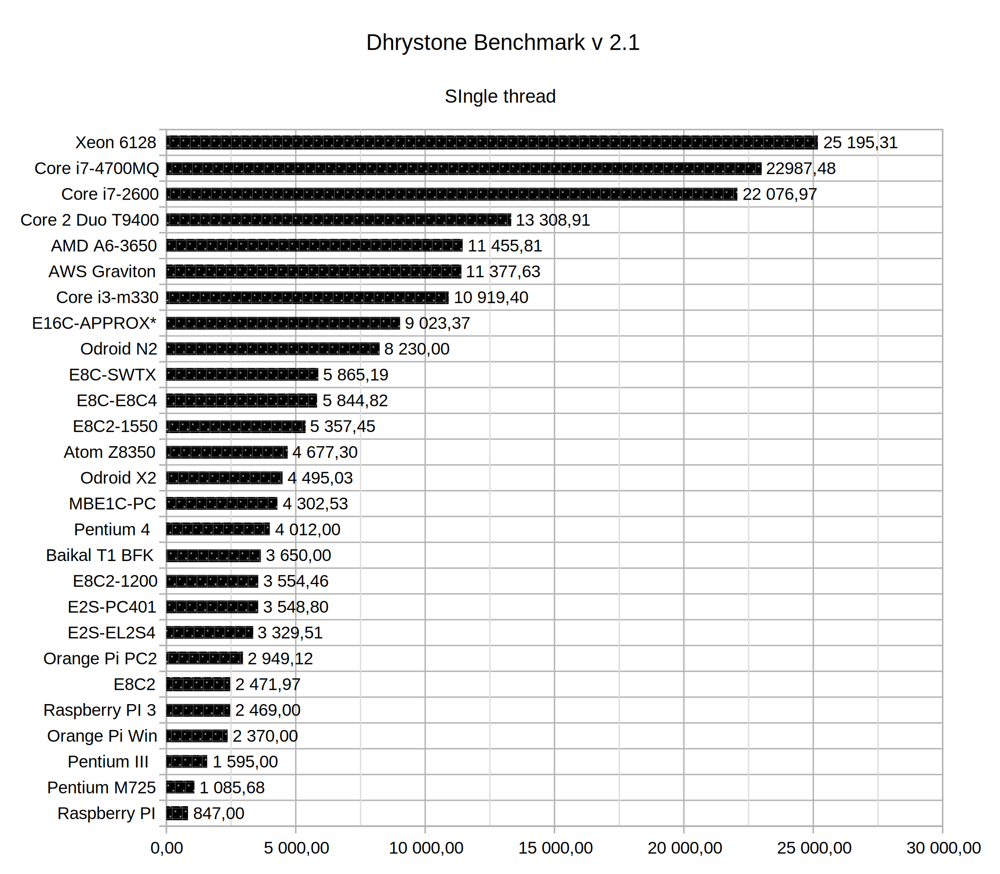

Dhrystone, на 1 МГц:
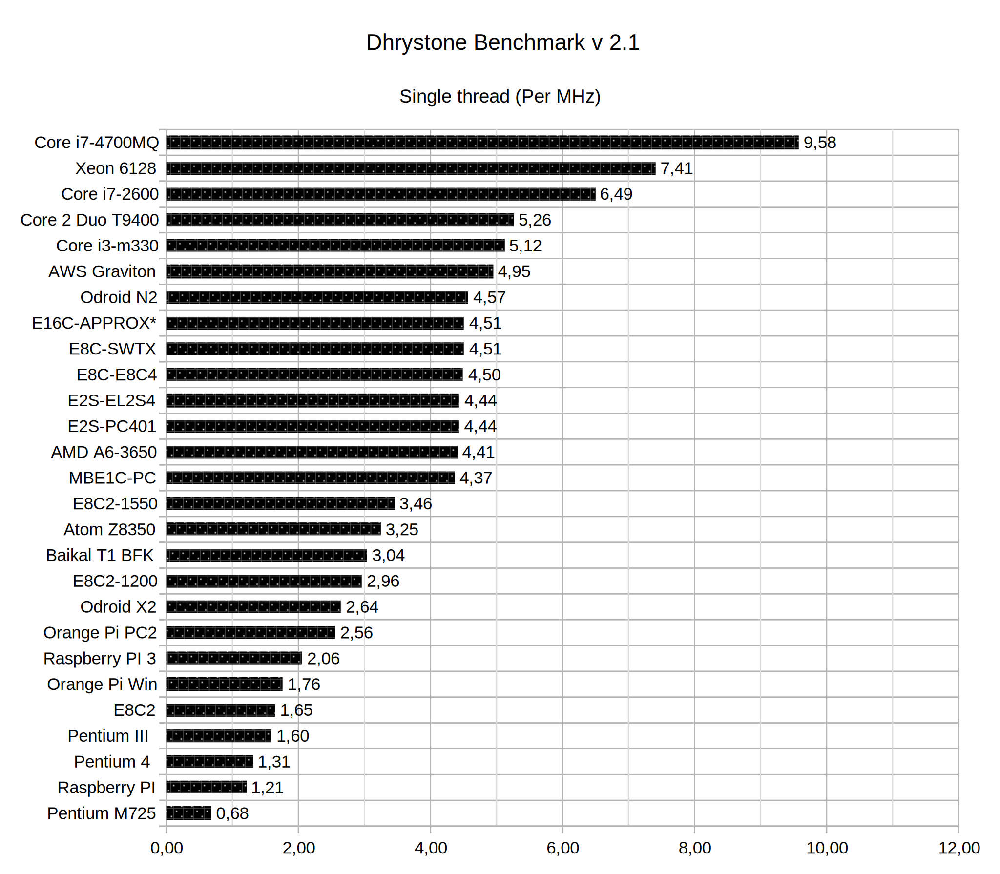

Dhrystone, относительно Core i7-2600:
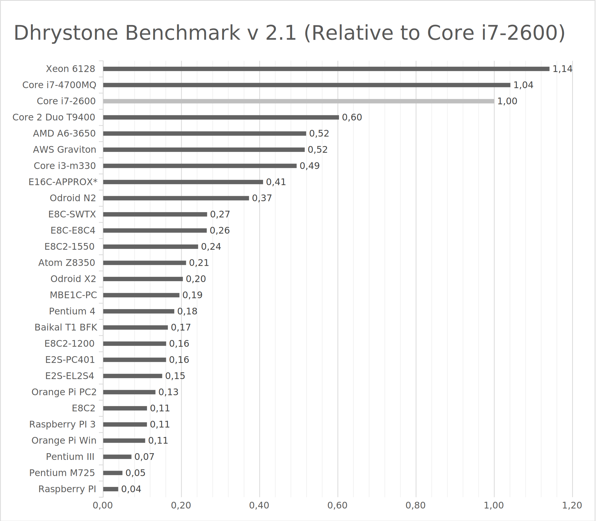

Здесь видно, что в тесте Dhrystone процессоры x86 заметно быстрее arm и Эльбрус процессоров. Производительность 1 ядра Эльбрус 8С (E8C) сравнима с ядром Cortex A72, если сравнивать относительно Dhrystones на 1 МГц, Эльбрус 8С чуть быстрее Atom Z8350 относительно Dhrystones на 1 МГц. Производительность Baikal T1 сравнима с ядром Arm Cortex A9. Странно себя показал Эльбрус 8СВ, который с большой частотой оказался медленнее Эльбрус 8С. В МЦСТ мне ответили, что этот экземпляр тестовый и компилятор немного не доработан под данную версию, возможно с другим экземпляром тесты окажутся гораздо лучше.


### Whetstone

| Platform         | CPU                                              | Cores | Frequency (MHz) | Architecture | MWIPS    | MWIPS MP         | MWIPS/MHz/Core | MWIPS MP/MHz | Relative to Core i7-2600 | Relative to Core i7-2600 (mp) |
| ---------------- | ------------------------------------------------ | ----- | --------------- | ------------ | -------- | ---------------- | -------------- | ------------ | ------------------------ | ----------------------------- |
| Xeon 6128        | Intel(R) Xeon(R) Gold 6128 CPU @ 3.40GHz (2 CPU) | 24    | 3400            | amd64        | 5 850,41 | 123854           | 1,72           | 36,43        | 1,02                     | 3,95                          |
| Core i7-4700MQ   | Intel(R) Core(TM) i7-4700MQ CPU @ 2.40GHz        | 8     | 2400            | amd64        | 5326,899 | 35234            | 2,22           | 14,68        | 0,93                     | 1,13                          |
| Core i7-2600     | Intel(R) Core(TM) i7-2600 CPU @ 3.40GHz          | 8     | 3400            | amd64        | 5 729,52 | 31319            | 1,69           | 9,21         | 1,00                     | 1,00                          |
| Core 2 Duo T9400 | Intel(R) Core(TM) 2 Duo CPU     T9400  @ 2.53GHz | 2     | 2530            | amd64        | 2 910,33 | 5195             | 1,15           | 2,05         | 0,51                     | 0,17                          |
| Core i3-m330     | Intel(R) Core(TM) i3 CPU       M 330  @ 2.13GHz  | 4     | 2133            | amd64        | 2 824,97 | 8837             | 1,32           | 4,14         | 0,49                     | 0,28                          |
| Atom Z8350       | Intel(R) Atom(TM) x5-Z8350 CPU @ 1.44GHz         | 4     | 1440            | amd64        | 2 085,24 | 6636             | 1,45           | 4,61         | 0,36                     | 0,21                          |
| AMD A6-3650      | AMD A6-3650 APU with Radeon(tm) HD Graphics      | 4     | 2600            | amd64        | 3 718,16 | 12113            | 1,43           | 4,66         | 0,65                     | 0,39                          |
| Pentium M725     | Pentium M725                                     | 1     | 1600            | i386         | 506,94   | 506,94           | 0,32           | 0,32         | 0,09                     | 0,02                          |
| Pentium 4        | Intel(R) Pentium(TM) 4 CPU                       | 1     | 3066            | i386         | 1 119,00 | 1119             | 0,36           | 0,36         | 0,20                     | 0,04                          |
| Pentium III      | Intel(R) Pentium(TM) III CPU                     | 1     | 1000            | i386         | 816,00   | 816              | 0,82           | 0,82         | 0,14                     | 0,03                          |
| AWS Graviton     | Alpine AL73400                                   | 16    | 2300            | aarch64      | 2 851,80 | 44741            | 1,24           | 19,45        | 0,50                     | 1,43                          |
| Odroid N2        | Amlogic S922X                                    | 6     | 1800            | aarch64      | 2 136,98 | 9931             | 1,19           | 5,52         | 0,37                     | 0,32                          |
| Odroid X2        | Samsung Exynos 4412 (armv7l)                     | 4     | 1700            | arm          | 1 305,16 | 4291             | 0,77           | 2,52         | 0,23                     | 0,14                          |
| Orange Pi PC2    | Allwinner H5 (aarch64)                           | 4     | 1152            | aarch64      | 980,26   | 3798             | 0,85           | 3,30         | 0,17                     | 0,12                          |
| Orange Pi Win    | Allwinner A64 (aarch64)                          | 4     | 1344            | aarch64      | 700,60   | 1854             | 0,52           | 1,38         | 0,12                     | 0,06                          |
| Raspberry PI 3   | Broadcom BCM2837B0 (armv8)                       | 4     | 1200            | aarch64      | 997,20   | 2779,8           | 0,83           | 2,32         | 0,17                     | 0,09                          |
| Raspberry PI     | Broadcom BCM2835                                 | 1     | 700             | arm          | 270,50   | 270,5            | 0,39           | 0,39         | 0,05                     | 0,01                          |
| E16C-APPROX*     | Elbrus 16                                        | 16    | 2000            | e2k          | 2 198,39 | 37605,0064516129 | 1,10           | 18,80        | 0,38                     | 1,20                          |
| E8C2-1550        | Elbrus 8C2 (E8C2 1550 MHz)                       | 8     | 1550            | e2k          | 1 703,75 | 14571,94         | 1,10           | 9,40         | 0,30                     | 0,47                          |
| E8C2             | Elbrus 8C2 (E8C2)                                | 8     | 1500            | e2k          | 1 703,75 | 14571,94         | 1,14           | 9,71         | 0,30                     | 0,47                          |
| E8C2-1200        | Elbrus 8C2 (Broken 8MB Cache 1.2 GHz)            | 8     | 1200            | e2k          | 1 545,92 | 12420            | 1,29           | 10,35        | 0,27                     | 0,40                          |
| E8C-SWTX         | Elbrus 8C (E8C-SWTX)                             | 8     | 1300            | e2k          | 1 517,62 | 12980            | 1,17           | 9,98         | 0,26                     | 0,41                          |
| E8C-E8C4         | Elbrus 8C (4 CPU)                                | 32    | 1300            | e2k          | 1 647,51 | 53563            | 1,27           | 41,20        | 0,29                     | 1,71                          |
| E2S-EL2S4        | Elbrus 4C [EL2S4] (4 CPU)                        | 16    | 750             | e2k          | 970,80   | 15790            | 1,29           | 21,05        | 0,17                     | 0,50                          |
| E2S-PC401        | Elbrus 4C [E2S] (pc401)                          | 4     | 800             | e2k          | 938,12   | 2455             | 1,17           | 3,07         | 0,16                     | 0,08                          |
| MBE1C-PC         | Elbrus 1C+ (MBE1C-PC)                            | 1     | 985             | e2k          | 1 277,55 | 1312             | 1,30           | 1,33         | 0,22                     | 0,04                          |
| Baikal T1 BFK    | Baikal-T1 (MIPS P5600 V3.0)                      | 2     | 1200            | mips         | 613,50   | 1227             | 0,51           | 1,02         | 0,11                     | 0,04                          |


Whetstone Single Precision, все процессоры
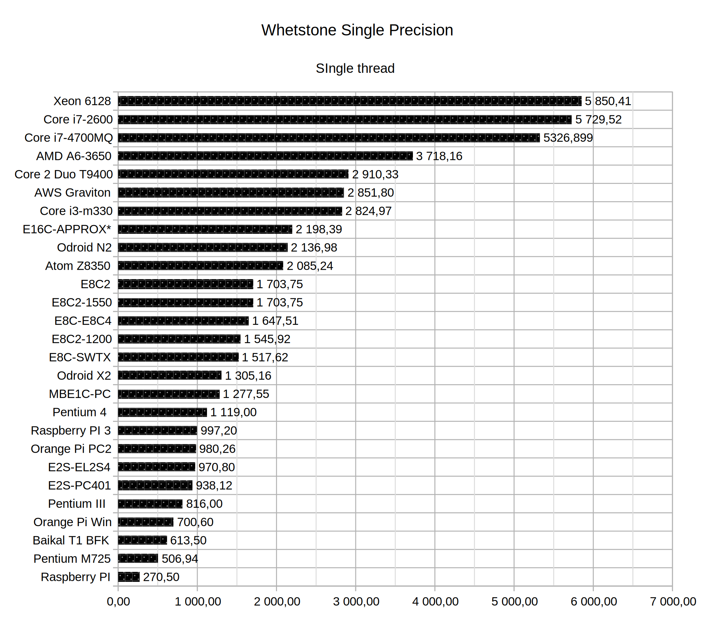

Whetstone Single Precision, многопоточные результаты
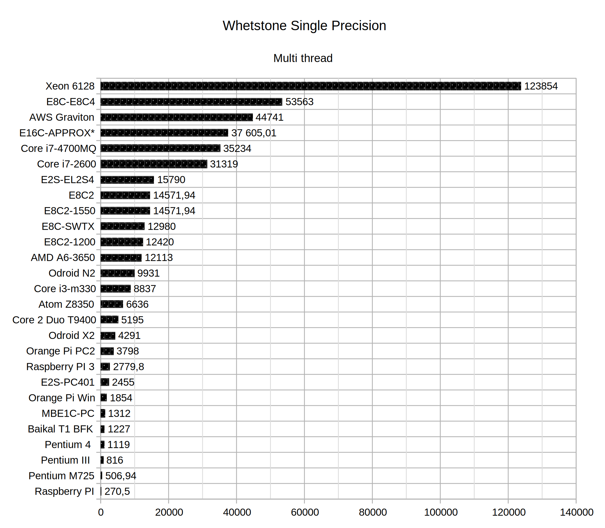

Whetstone Single Precision, на 1 МГц
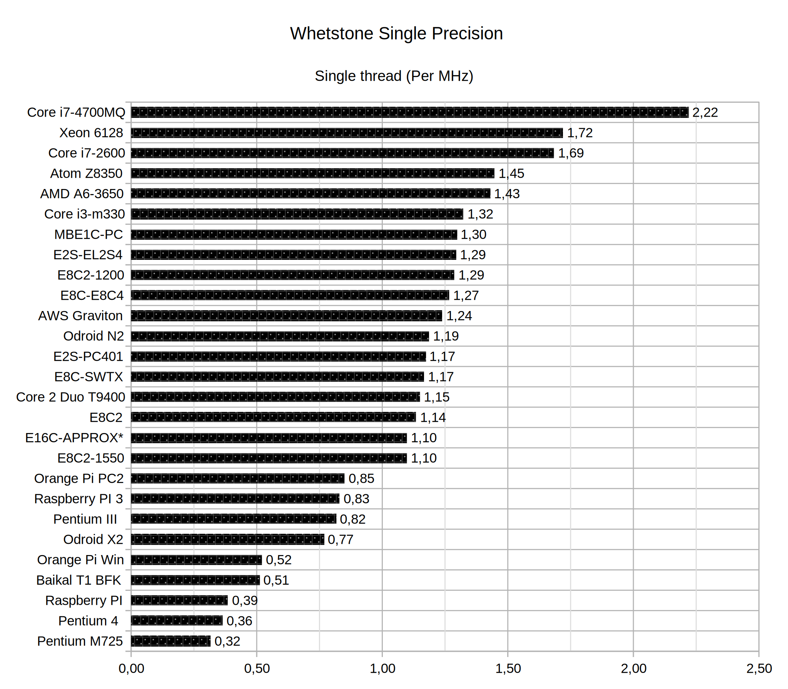

Whetstone Single Precision, многопоточные результаты, на 1 МГц
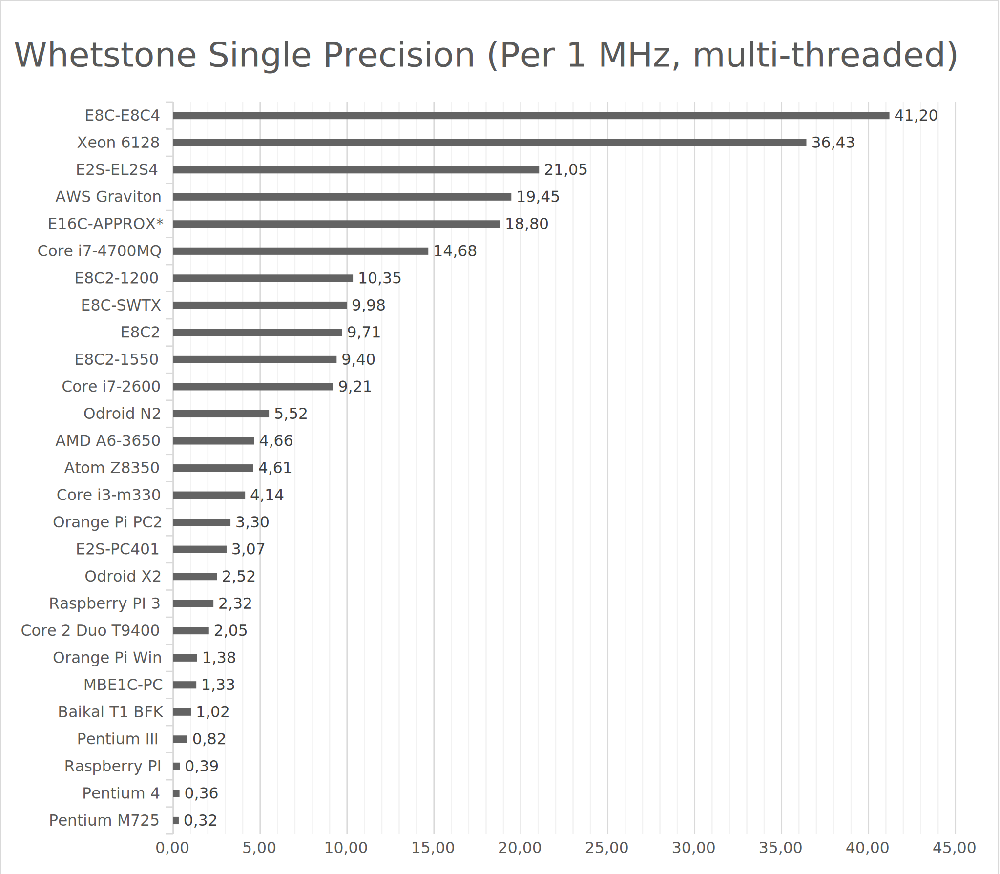

Whetstone Single Precision, относительно Core i7-2600
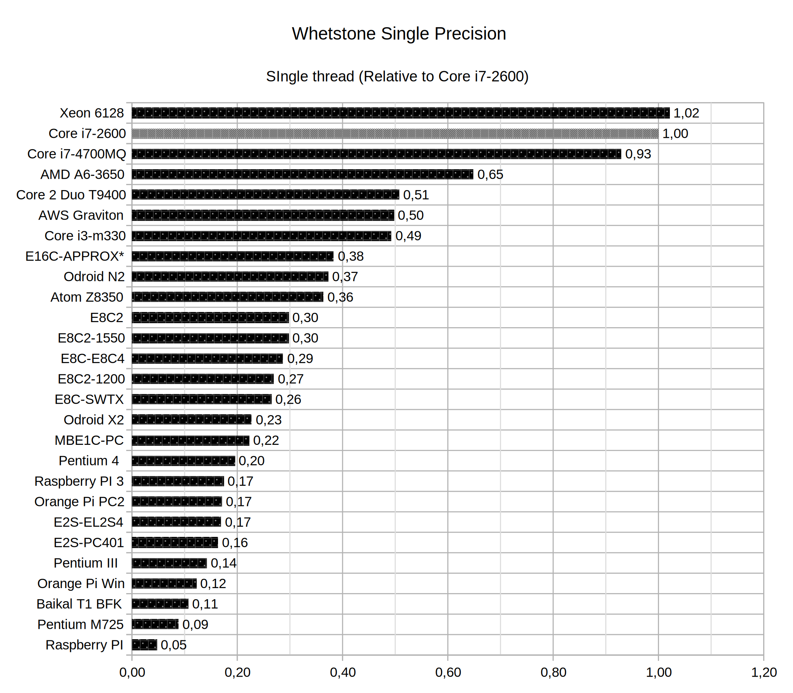

Whetstone Single Precision, многопоточные результаты, относительно Core i7-2600


Мы видим, что процессоры ARM v7 на архитектуре ядра Cortex A9 сопоставимы с процессорами Pentium III, если сравнивать частоту на 1 Мгц.
Далее, процессоры ARM v8 на архитектуре ядра Cortex A72 сравнимы с процессорами Core 2 Duo T9400 на 1 ядро и 1 МГц, но немного не дотягивают
до Atom Z8350. А ещё очень хорошо видно, что архитектура процессора Pentium 4 (NetBurst) была очень слабой и чтобы им быть более
менее производительными, нужно было иметь высокую частоту (Pentium III был более производительным на 1 МГц).
Все процессоры Эльбрус сопоставимы с Core 2 Duo T9400 на 1 ядро и относительно 1 МГц и ARM v7 Cortex A72, что уже лучше.

#### Whetstone: разные рантаймы и языки программирования

| Platform         | CPU                                              | Cores | Frequency (MHz) | Architecture | MWIPS    | MWIPS MP | MWIPS mono | MWIPS netcore | MWIPS java | MWIPS js |
| ---------------- | ------------------------------------------------ | ----- | --------------- | ------------ | -------- | -------- | ---------- | ------------- | ---------- | -------- |
| MBE1C-PC         | Elbrus 1C+ (MBE1C-PC)                            | 1     | 985             | e2k          | 1 277,55 | 1312     | 388,32     |               | 390,89     |          |
| Orange Pi Win    | Allwinner A64 (aarch64)                          | 4     | 1344            | aarch64      | 700,60   | 1854     |            | 359,00        |            | 102,18   |
| Raspberry PI 3   | Broadcom BCM2837B0 (armv8)                       | 4     | 1200            | aarch64      | 997,20   | 2779,8   |            |               | 183,43     |          |
| Orange Pi PC2    | Allwinner H5 (aarch64)                           | 4     | 1152            | aarch64      | 980,26   | 3798     | 349,36     | 400,24        |            | 172,81   |
| Odroid X2        | Samsung Exynos 4412 (armv7l)                     | 4     | 1700            | arm          | 1 305,16 | 4291     | 256,84     | 650,11        |            |          |
| Core 2 Duo T9400 | Intel(R) Core(TM) 2 Duo CPU     T9400  @ 2.53GHz | 2     | 2530            | amd64        | 2 910,33 | 5195     | 1 565,27   | 1 992,41      |            |          |
| AMD A6-3650      | AMD A6-3650 APU with Radeon(tm) HD Graphics      | 4     | 2600            | amd64        | 3 718,16 | 12113    | 1 607,52   | 1 823,62      | 2 127,90   | 2098,08  |
| E8C-SWTX         | Elbrus 8C (E8C-SWTX)                             | 8     | 1300            | e2k          | 1 517,62 | 12980    | 522,99     |               | 1036,59    | 35,3     |
| Core i7-2600     | Intel(R) Core(TM) i7-2600 CPU @ 3.40GHz          | 8     | 3400            | amd64        | 5 729,52 | 31319    | 2 751,55   | 3 262,26      |            |          |
| E8C-E8C4         | Elbrus 8C (4 CPU)                                | 32    | 1300            | e2k          | 1 647,51 | 53563    | 521,70     |               | 1022,26    | 35,1     |


### LINPACK 100x100 DP (однопоточный)

Существуют LINPACK 1000x1000, High Performance LINPACK, LINPACK 100x100.
Но был выбран LINPACK 100x100 DP, почему? Причина проста: данный тест легко собирается на разных архитектурах и время тестирования очень небольшое.

И тут сразу переходим к результатам тестирования:

| Platform         | FIELD2   | CPU                                              | Cores | Frequency (MHz) | Per MHz | Relative | Relative (MHz) | Architecture |
| ---------------- | -------- | ------------------------------------------------ | ----- | --------------- | ------- | -------- | -------------- | ------------ |
| Xeon 6128        | 6 105,95 | Intel(R) Xeon(R) Gold 6128 CPU @ 3.40GHz (2 CPU) | 24    | 3400            | 1,80    | 1,24     | 0,88           | amd64        |
| Core i7-4700MQ   | 4 915,84 | Intel(R) Core(TM) i7-4700MQ CPU @ 2.40GHz        | 8     | 2400            | 2,05    | 1,00     | 1,00           | amd64        |
| Core i7-2600     | 4 302,89 | Intel(R) Core(TM) i7-2600 CPU @ 3.40GHz          | 8     | 3400            | 1,27    | 0,88     | 0,62           | amd64        |
| Core 2 Duo T9400 | 1 816,02 | Intel(R) Core(TM) 2 Duo CPU     T9400  @ 2.53GHz | 2     | 2530            | 0,72    | 0,37     | 0,35           | amd64        |
| Core i3-m330     | 2 155,62 | Intel(R) Core(TM) i3 CPU       M 330  @ 2.13GHz  | 4     | 2133            | 1,01    | 0,44     | 0,49           | amd64        |
| Atom Z8350       | 1 021,44 | Intel(R) Atom(TM) x5-Z8350 CPU @ 1.44GHz         | 4     | 1440            | 0,71    | 0,21     | 0,35           | amd64        |
| AMD A6-3650      | 1 750,03 | AMD A6-3650 APU with Radeon(tm) HD Graphics      | 4     | 2600            | 0,67    | 0,36     | 0,33           | amd64        |
| Pentium M725     | 338,82   | Pentium M725                                     | 1     | 1600            | 0,21    | 0,07     | 0,10           | i386         |
| Pentium 4        | 840,27   | Intel(R) Pentium(TM) 4 CPU                       | 1     | 3066            | 0,27    | 0,17     | 0,13           | i386         |
| Pentium III      | 316,67   | Intel(R) Pentium(TM) III CPU                     | 1     | 1000            | 0,32    | 0,06     | 0,15           | i386         |
| AWS Graviton     | 1 548,65 | Alpine AL73400                                   | 16    | 2300            | 0,67    | 0,32     | 0,33           | aarch64      |
| Odroid N2        | 845,09   | Amlogic S922X                                    | 6     | 1800            | 0,47    | 0,17     | 0,23           | aarch64      |
| Odroid X2        | 268,73   | Samsung Exynos 4412 (armv7l)                     | 4     | 1700            | 0,16    | 0,05     | 0,08           | arm          |
| Orange Pi PC2    | 163,44   | Allwinner H5 (aarch64)                           | 4     | 1152            | 0,14    | 0,03     | 0,07           | aarch64      |
| Orange Pi Win    | 174,04   | Allwinner A64 (aarch64)                          | 4     | 1344            | 0,13    | 0,04     | 0,06           | aarch64      |
| Raspberry PI 3   | 180,00   | Broadcom BCM2837B0 (armv8)                       | 4     | 1200            | 0,15    | 0,04     | 0,07           | aarch64      |
| Raspberry PI     | 42,00    | Broadcom BCM2835                                 | 1     | 700             | 0,06    | 0,01     | 0,03           | arm          |
| E16C-APPROX      | 1 675,42 | Elbrus 16                                        | 16    | 2000            | 0,84    | 0,34     | 0,41           | e2k          |
| E8C2-1550        | 1 269,79 | Elbrus 8C2 (E8C2 1550 MHz)                       | 8     | 1550            | 0,82    | 0,26     | 0,40           | e2k          |
| E8C2             | 1 257,24 | Elbrus 8C2 (E8C2)                                | 8     | 1500            | 0,84    | 0,26     | 0,41           | e2k          |
| E8C2-1200        | 1 005,79 | Elbrus 8C2 (Broken 8MB Cache 1.2 GHz)            | 8     | 1200            | 0,84    | 0,20     | 0,41           | e2k          |
| E8C-SWTX         | 1 075,27 | Elbrus 8C (E8C-SWTX)                             | 8     | 1300            | 0,83    | 0,22     | 0,40           | e2k          |
| E8C-E8C4         | 1 089,02 | Elbrus 8C (4 CPU)                                | 32    | 1300            | 0,84    | 0,22     | 0,41           | e2k          |
| E2S-EL2S4        | 632,51   | Elbrus 4C [EL2S4] (4 CPU)                        | 16    | 750             | 0,84    | 0,13     | 0,41           | e2k          |
| E2S-PC401        | 674,68   | Elbrus 4C [E2S] (pc401)                          | 4     | 800             | 0,84    | 0,14     | 0,41           | e2k          |
| MBE1C-PC         | 814,76   | Elbrus 1C+ (MBE1C-PC)                            | 1     | 985             | 0,83    | 0,17     | 0,40           | e2k          |
| Baikal T1 BFK    |          | Baikal-T1 (MIPS P5600 V3.0)                      | 2     | 1200            | 0,00    | 0,00     | 0,00           | mips         |


LINPACK 100x100 Double Precision, все процессоры
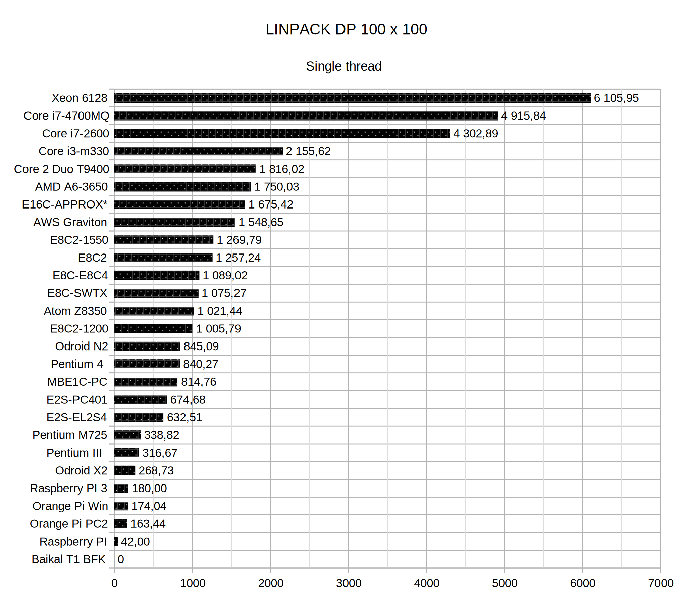

LINPACK 100x100 Double Precision, на 1 МГц
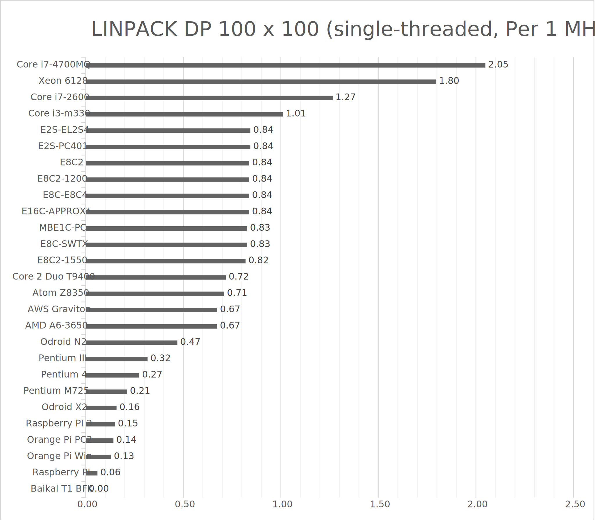

LINPACK 100x100 Double Precision, относительно Core i7-2600
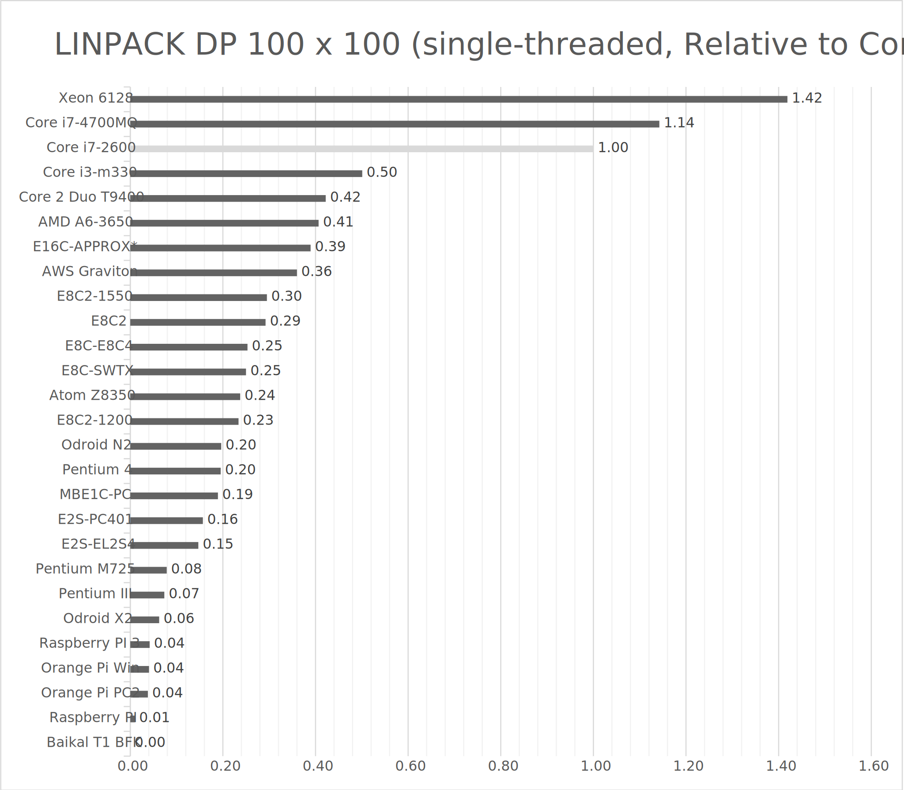

Cнова сравним  Mflops'ы на 1 МГц на 1 ядро.

Ядра ARM v7 Cortex A9 (Odroid X2), ARM v8 Cortex A53 (Raspberry PI 3, Orange Pi Win, Orange Pi PC2 ) показывают слабый результат, даже слабее Pentium III, что даже кажется немного странным. Ядра ARM v8 Cortex A72 (Odroid N2, AWS Graviton [Alpine AL73400]) держатся почти на уровне Core 2 Duo T9400 и Atom Z8350 и это отлично. 

Эльбрусы E2K (Все модели: E1C+, E4C, E8C1, E8C2 ) показывают одинаковый результат и сильно обгоняют ARM процессоры, даже ядра Cortex A72, но проигрывают в 1,5 - 2 раза современным процессорам Intel, хотя они обгоняют AMD A6-3650 и Core 2 Duo T9400. Эльбрусам не хватает высокой тактовой частоты, чтобы приблизиться к процессорам Intel.

### Coremark

| Platform         | CPU                                              | Cores | Frequency (MHz) | Architecture | Coremark  | Coremark (multithread) | Coremark/MHz/Core | Coremark/MHz | Relative to Core i7-2600 | Relative to Core i7-2600 (mp) |
| ---------------- | ------------------------------------------------ | ----- | --------------- | ------------ | --------- | ---------------------- | ----------------- | ------------ | ------------------------ | ----------------------------- |
| Xeon 6128        | Intel(R) Xeon(R) Gold 6128 CPU @ 3.40GHz (2 CPU) | 24    | 3400            | amd64        | 28 210,73 | 670 625,22             | 0,04              | 1,00         | 1,16                     | 5,44                          |
| Core i7-4700MQ   | Intel(R) Core(TM) i7-4700MQ CPU @ 2.40GHz        | 8     | 2400            | amd64        | 24 295,43 | 123 260,23             | 0,20              | 1,00         | 1,00                     | 1,00                          |
| Core i7-2600     | Intel(R) Core(TM) i7-2600 CPU @ 3.40GHz          | 8     | 3400            | amd64        | 22 692,89 | 119 670,91             | 0,19              | 1,00         | 0,93                     | 0,97                          |
| Core 2 Duo T9400 | Intel(R) Core(TM) 2 Duo CPU     T9400  @ 2.53GHz | 2     | 2530            | amd64        | 12 481,28 | 23 950,66              | 0,52              | 1,00         | 0,51                     | 0,19                          |
| Core i3-m330     | Intel(R) Core(TM) i3 CPU       M 330  @ 2.13GHz  | 4     | 2133            | amd64        | 9 980,95  | 24 252,71              | 0,41              | 1,00         | 0,41                     | 0,20                          |
| Atom Z8350       | Intel(R) Atom(TM) x5-Z8350 CPU @ 1.44GHz         | 4     | 1440            | amd64        | 6 893,09  | 23 814,68              | 0,29              | 1,00         | 0,28                     | 0,19                          |
| AMD A6-3650      | AMD A6-3650 APU with Radeon(tm) HD Graphics      | 4     | 2600            | amd64        | 11 810,56 | 41 666,67              | 0,28              | 1,00         | 0,49                     | 0,34                          |
| Pentium M725     | Pentium M725                                     | 1     | 1600            | i386         | 2 018,44  | 2 018,44               | 1,00              | 1,00         | 0,08                     | 0,02                          |
| Pentium 4        | Intel(R) Pentium(TM) 4 CPU                       | 1     | 3066            | i386         | 5 941,45  | 5 941,45               | 1,00              | 1,00         | 0,24                     | 0,05                          |
| Pentium III      | Intel(R) Pentium(TM) III CPU                     | 1     | 1000            | i386         | 2 246,57  | 2 246,57               | 1,00              | 1,00         | 0,09                     | 0,02                          |
| AWS Graviton     | Alpine AL73400                                   | 16    | 2300            | aarch64      |           |                        |                   |              | 0,00                     | 0,00                          |
| Odroid N2        | Amlogic S922X                                    | 6     | 1800            | aarch64      |           |                        |                   |              | 0,00                     | 0,00                          |
| Odroid X2        | Samsung Exynos 4412 (armv7l)                     | 4     | 1700            | arm          | 6 109,07  | 24 162,55              | 0,25              | 1,00         | 0,25                     | 0,20                          |
| Orange Pi PC2    | Allwinner H5 (aarch64)                           | 4     | 1152            | aarch64      | 3 869,72  | 14 901,28              | 0,26              | 1,00         | 0,16                     | 0,12                          |
| Orange Pi Win    | Allwinner A64 (aarch64)                          | 4     | 1344            | aarch64      | 3 840,98  | 15 370,82              | 0,25              | 1,00         | 0,16                     | 0,12                          |
| Raspberry PI 3   | Broadcom BCM2837B0 (armv8)                       | 4     | 1200            | aarch64      | 3 841,00  | 15 363,93              | 0,25              | 1,00         | 0,16                     | 0,12                          |
| Raspberry PI     | Broadcom BCM2835                                 | 1     | 700             | arm          | 1 303,78  | 1 303,78               | 1,00              | 1,00         | 0,05                     | 0,01                          |
| E16C-APPROX*     | Elbrus 16                                        | 16    | 2000            | e2k          | 5 625,18  | 88 994,16              | 0,06              | 1,00         | 0,23                     | 0,72                          |
| E8C2-1550        | Elbrus 8C2 (E8C2 1550 MHz)                       | 8     | 1550            | e2k          | 4 359,51  | 34 485,24              | 0,13              | 1,00         | 0,18                     | 0,28                          |
| E8C2             | Elbrus 8C2 (E8C2)                                | 8     | 1500            | e2k          | 4 266,70  | 33 165,69              | 0,13              | 1,00         | 0,18                     | 0,27                          |
| E8C2-1200        | Elbrus 8C2 (Broken 8MB Cache 1.2 GHz)            | 8     | 1200            | e2k          | 3 413,36  | 26 396,83              | 0,13              | 1,00         | 0,14                     | 0,21                          |
| E8C-SWTX         | Elbrus 8C (E8C-SWTX)                             | 8     | 1300            | e2k          | 3 711,00  | 28 846,15              | 0,13              | 1,00         | 0,15                     | 0,23                          |
| E8C-E8C4         | Elbrus 8C (4 CPU)                                | 32    | 1300            | e2k          | 3 813,64  | 117 885,43             | 0,03              | 1,00         | 0,16                     | 0,96                          |
| E2S-EL2S4        | Elbrus 4C [EL2S4] (4 CPU)                        | 16    | 750             | e2k          | 2 216,48  | 34 457,87              | 0,06              | 1,00         | 0,09                     | 0,28                          |
| E2S-PC401        | Elbrus 4C [E2S] (pc401)                          | 4     | 800             | e2k          | 2 364,24  | 36 755,06              | 0,06              | 1,00         | 0,10                     | 0,30                          |
| MBE1C-PC         | Elbrus 1C+ (MBE1C-PC)                            | 1     | 985             | e2k          | 2 901,49  | 2 848,32               | 1,02              | 1,00         | 0,12                     | 0,02                          |
| Baikal T1        | Baikal-T1 (MIPS P5600 V3.0)                      | 2     | 1200            | mips         | 6 182,00  | 12 364,00              | 0,50              | 1,00         | 0,25                     | 0,10                          |


Coremark, однопоточные результаты, все процессоры
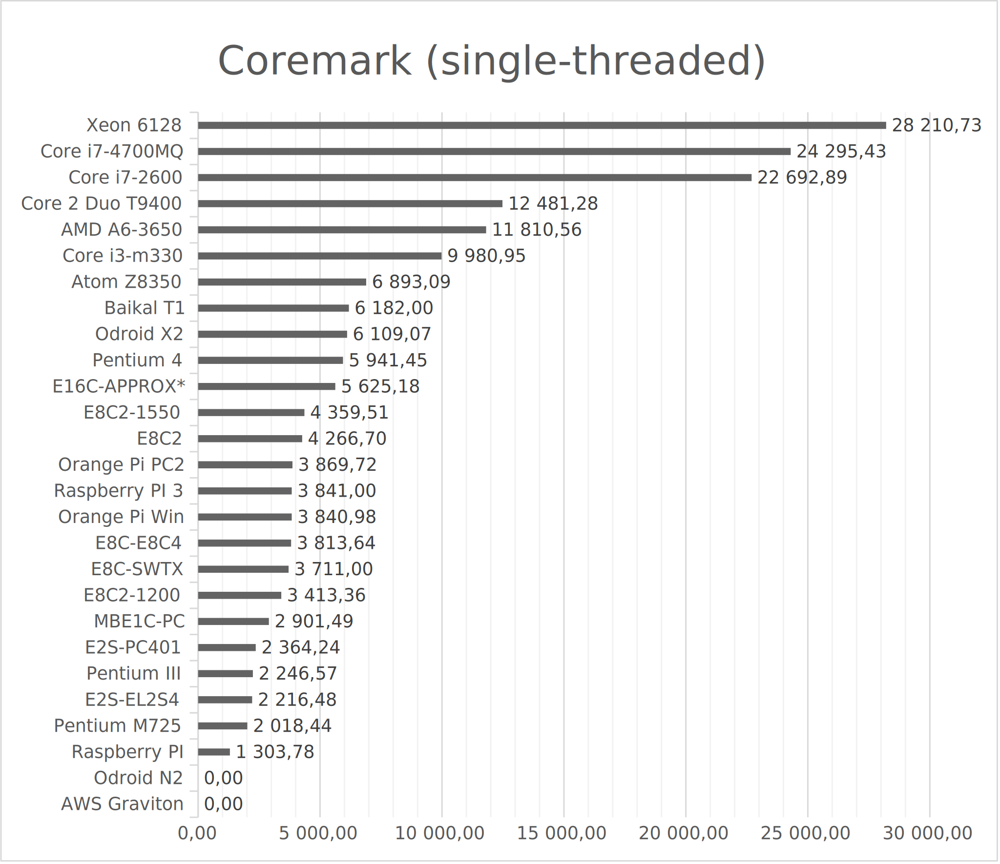

Coremark, многопоточные результаты, все процессоры
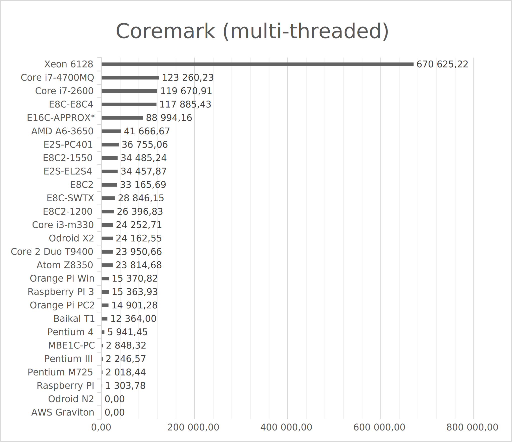

Coremark, однопоточные результаты, на 1 МГц
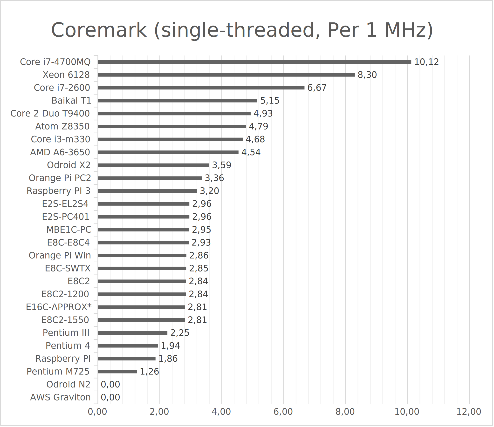

Coremark, многопоточные результаты, на 1 МГц
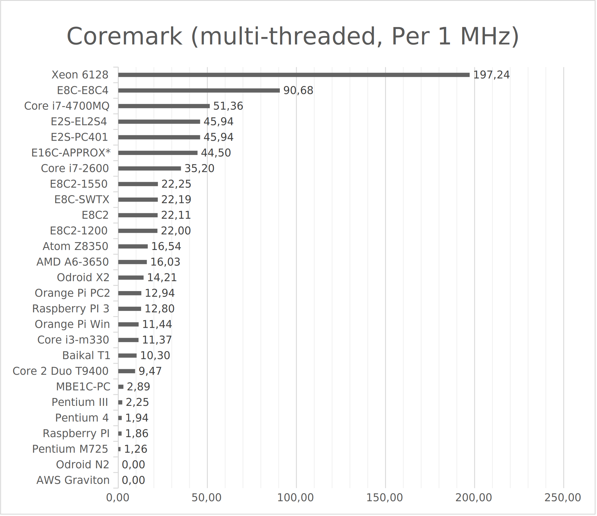

Coremark, однопоточные результаты, относительно Core i7-2600
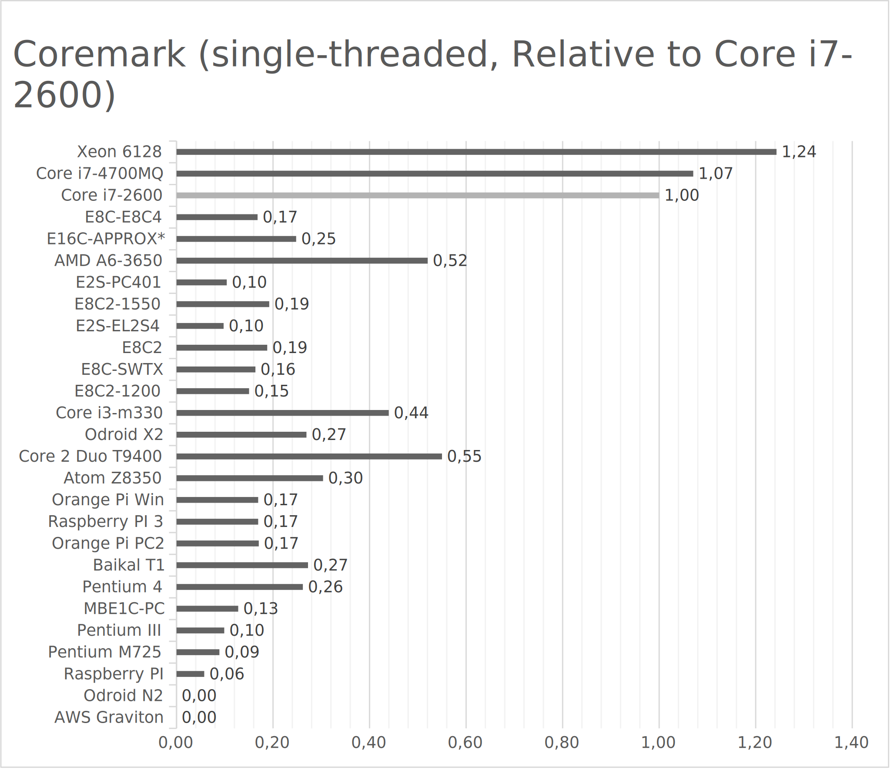

Coremark, многопоточные результаты, относительно Core i7-2600
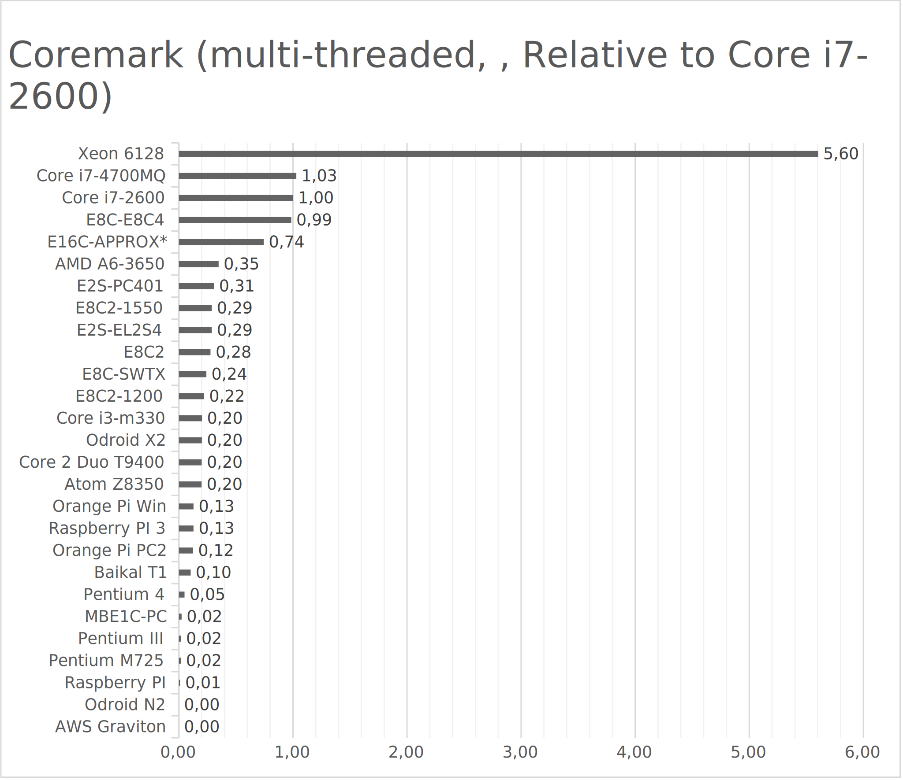

В этом тесте ядра Эльбрус на 1 МГц оказываются немного слабее ядер ARM (Cortex A9, Cortex A53) и в 3 раза слабее современных ядер Intel (Core i7-2600 ),
ядра ARM (Cortex A9, Cortex A53) почти что на уровне Atom Z8350, Core 2 Duo T9400 и AMD A6-3650. Процессор Baikal T1 немного обгоняет  Atom Z8350, Core 2 Duo T9400 и AMD A6-3650,
а в реальных частотах он на уровне Atom Z8350.

### Memspeed (однопоточный)

```c
(x[i] = x[i] + a * y[i])
```

```c
(x[i] = x[i] + y[i])
```

```c
(x[i] = y[i])
```


|Platform        |CPU                                             |Cores|Frequency (MHz)|FIELD5 |16 KB, x[m]=x[m]+s*y[m] Sngl|512 KB, x[m]=x[m]+s*y[m] Sngl|8192 KB, x[m]=x[m]+s*y[m] Sngl|16 KB, x[m]=x[m]+y[m] Sngl|512 KB, x[m]=x[m]+y[m] Sngl|8192 KB, x[m]=x[m]+y[m] Sngl|16 KB, x[m]=y[m] Sngl|512 KB, x[m]=y[m] Sngl|8192 KB, x[m]=y[m] Sngl|
|----------------|------------------------------------------------|-----|---------------|-------|----------------------------|-----------------------------|------------------------------|--------------------------|---------------------------|----------------------------|---------------------|----------------------|-----------------------|
|Pentium 4       |Intel(R) Pentium(TM) 4 CPU                      |1    |3066           |i386   |0                           |0                            |0                             |0                         |0                          |0                           |0                    |0                     |0                      |
|Pentium III     |Intel(R) Pentium(TM) III CPU                    |1    |1000           |i386   |0                           |0                            |0                             |0                         |0                          |0                           |0                    |0                     |0                      |
|E16C-APPROX*    |Elbrus 16                                       |16   |2000           |e2k    |0                           |0                            |0                             |0                         |0                          |0                           |0                    |0                     |0                      |
|Baikal T1 BFK   |Baikal-T1 (MIPS P5600 V3.0)                     |2    |1200           |mips   |0                           |0                            |0                             |0                         |0                          |0                           |0                    |0                     |0                      |
|Raspberry PI    |Broadcom BCM2835                                |1    |700            |arm    |127                         |127                          |127                           |731                       |127                        |127                         |426                  |111                   |111                    |
|Pentium M725    |Pentium M725                                    |1    |1600           |i386   |1915                        |1530                         |844                           |2348                      |1670                       |850                         |1866                 |1145                  |420                    |
|Raspberry PI 3  |Broadcom BCM2837B0 (armv8)                      |4    |1200           |aarch64|1324                        |1598                         |1019                          |2240                      |1906                       |954                         |3136                 |2783                  |871                    |
|Core 2 Duo T9400|Intel(R) Core(TM) 2 Duo CPU     T9400  @ 2.53GHz|2    |2530           |amd64  |20403                       |14189                        |8249                          |18113                     |9344                       |8153                        |3232                 |5196                  |2131                   |
|Orange Pi Win   |Allwinner A64 (aarch64)                         |4    |1344           |aarch64|1598                        |1752                         |1019                          |2771                      |1787                       |1028                        |3483                 |3146                  |1374                   |
|Odroid X2       |Samsung Exynos 4412 (armv7l)                    |4    |1700           |arm    |2364                        |1464                         |1261                          |2543                      |1472                       |1271                        |3856                 |1324                  |627                    |
|Orange Pi PC2   |Allwinner H5 (aarch64)                          |4    |1152           |aarch64|1311                        |1224                         |1039                          |2872                      |1179                       |1009                        |4902                 |2284                  |1261                   |
|MBE1C-PC        |Elbrus 1C+ (MBE1C-PC)                           |1    |985            |e2k    |13327                       |31305                        |5856                          |10999                     |11421                      |9663                        |5073                 |10442                 |1163                   |
|E8C2            |Elbrus 8C2 (E8C2)                               |8    |1500           |e2k    |41032                       |41708                        |33881                         |19815                     |12399                      |9617                        |6124                 |4376                  |3318                   |
|Odroid N2       |Amlogic S922X                                   |6    |1800           |aarch64|8452                        |8214                         |3888                          |9876                      |8463                       |3966                        |8261                 |7260                  |3582                   |
|E2S-PC401       |Elbrus 4C [E2S] (pc401)                         |4    |800            |e2k    |22896                       |22106                        |8491                          |10053                     |6591                       |2092                        |8415                 |6145                  |1468                   |
|Atom Z8350      |Intel(R) Atom(TM) x5-Z8350 CPU @ 1.44GHz        |4    |1440           |amd64  |17395                       |14596                        |5208                          |17415                     |14356                      |5219                        |10075                |5598                  |1365                   |
|E2S-EL2S4       |Elbrus 4C [EL2S4] (4 CPU)                       |16   |750            |e2k    |21463                       |22714                        |7975                          |20662                     |23032                      |7809                        |10535                |11483                 |4263                   |
|Core i3-m330    |Intel(R) Core(TM) i3 CPU       M 330  @ 2.13GHz |4    |2133           |amd64  |22267                       |12837                        |4636                          |22396                     |13193                      |4996                        |10774                |8340                  |2387                   |
|AWS Graviton    |Alpine AL73400                                  |16   |2300           |aarch64|21353                       |17418                        |7336                          |7344                      |18328                      |21796                       |12118                |12120                 |4422                   |
|AMD A6-3650     |AMD A6-3650 APU with Radeon(tm) HD Graphics     |4    |2600           |amd64  |40906                       |37749                        |8578                          |40988                     |36529                      |8523                        |13655                |9154                  |2154                   |
|E8C2-1200       |Elbrus 8C2 (Broken 8MB Cache 1.2 GHz)           |8    |1200           |e2k    |34626                       |34168                        |28890                         |30016                     |34232                      |28920                       |16709                |18654                 |17513                  |
|E8C-E8C4        |Elbrus 8C (4 CPU)                               |32   |1300           |e2k    |37065                       |27882                        |23315                         |35758                     |27681                      |23172                       |18273                |16898                 |13798                  |
|E8C-SWTX        |Elbrus 8C (E8C-SWTX)                            |8    |1300           |e2k    |37092                       |29195                        |24130                         |37806                     |29193                      |24114                       |19096                |17431                 |14045                  |
|E8C2-1550       |Elbrus 8C2 (E8C2 1550 MHz)                      |8    |1550           |e2k    |44195                       |41990                        |36299                         |39990                     |42034                      |36355                       |21901                |23589                 |21518                  |
|Core i7-2600    |Intel(R) Core(TM) i7-2600 CPU @ 3.40GHz         |8    |3400           |amd64  |75172                       |53366                        |32794                         |75334                     |54605                      |32432                       |26348                |16541                 |8317                   |
|Core i7-4700MQ  |Intel(R) Core(TM) i7-4700MQ CPU @ 2.40GHz       |8    |2400           |amd64  |52992                       |29816                        |17618                         |59299                     |30982                      |18371                       |40254                |16127                 |9605                   |
|Xeon 6128       |Intel(R) Xeon(R) Gold 6128 CPU @ 3.40GHz (2 CPU)|24   |3400           |amd64  |57653                       |51351                        |26334                         |57982                     |52292                      |26638                       |45452                |37370                 |13360                  |


Memspeed, Умножение-сложение с присвоением, все процессоры
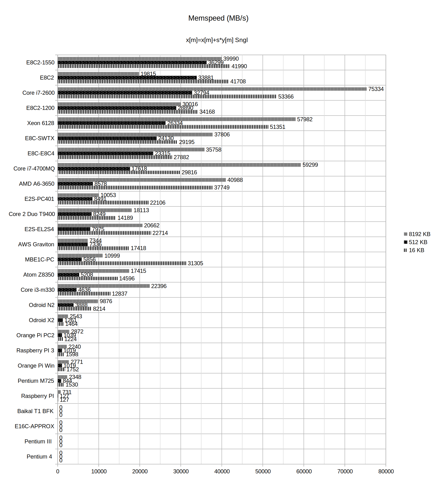

Memspeed, Сложение с присвоением, все процессоры
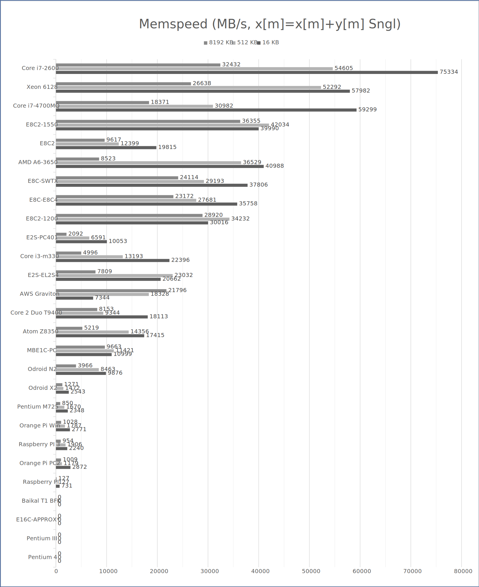

Memspeed, Присвоение, все процессоры


Как мы знаем, на скорость работы с памятью играют частотат работы с памятью, размеры кеша и латентность.

Процессоры ARM (Cortex A9, Cortex A53) имеют медленную подсистему памяти, AWS Graviton обгоняет их в несколько раз (что и логично, так как это серверный процессор).
Процессоры Эльбрус немного отстают от современных процессоров Intel так как имеют намного меньшую тактовую частоту (в 3 раза). Также можно заметить что процессор Эльбрус 8СВ немного быстрее
процессора Эльбрус 8С за счёт того, что используется память DDR4-2400. 

### MP MFLOPS

Примеры операций, которые выполняет данный тест:

2 операции
```c
x[i] = (x[i]+a)*b;
```

8 операций
```c
x[i] = (x[i]+a)*b-(x[i]+c)*d+(x[i]+e)*f;
```

32 операции
```c
x[i] = (x[i]+a)*b-(x[i]+c)*d+(x[i]+e)*f-(x[i]+g)*h+(x[i]+j)*k-(x[i]+l)*m+(x[i]+o)*p-(x[i]+q)*r+(x[i]+s)*t-(x[i]+u)*v+(x[i]+w)*y;
```

| Platform         | 2 ops/w – 102400 4B words | 2 ops/w – 1024000 4B words | 2 ops/w – 10240000 4B words | 8 ops/w – 102400 4B words | 8 ops/w – 1024000 4B words | 8 ops/w – 10240000 4B words | 32 ops/w – 102400 4B words | 32 ops/w – 1024000 4B words | 32 ops/w – 10240000 4B words | CPU                                              | Cores | Frequency (MHz) | Architecture | Geom Mean  | Relative geom mean |
| ---------------- | ------------------------- | -------------------------- | --------------------------- | ------------------------- | -------------------------- | --------------------------- | -------------------------- | --------------------------- | ---------------------------- | ------------------------------------------------ | ----- | --------------- | ------------ | ---------- | ------------------ |
| Atom Z8350       | 5 725,00                  | 1 303,00                   | 1 052,00                    | 11 934,00                 | 5 077,00                   | 4 204,00                    | 10 665,00                  | 10 456,00                   | 10 419,00                    | Intel(R) Atom(TM) x5-Z8350 CPU @ 1.44GHz         | 4     | 1440            | amd64        | 5 097,15   | 0,58               |
| Core 2 Duo T9400 | 6 614,00                  | 6 501,00                   | 949,00                      | 16 025,00                 | 16 043,00                  | 3 813,00                    | 24 236,00                  | 24 129,00                   | 13 724,00                    | Intel(R) Core(TM) 2 Duo CPU     T9400  @ 2.53GHz | 2     | 2530            | amd64        | 8 813,97   | 1,00               |
| Core i3-m330     | 7 256,00                  | 3 089,00                   | 2 177,00                    | 22 321,00                 | 12 217,00                  | 8 613,00                    | 25 115,00                  | 23 494,00                   | 17 535,00                    | Intel(R) Core(TM) i3 CPU       M 330  @ 2.13GHz  | 4     | 2133            | amd64        | 10 191,13  | 1,16               |
| AMD A6-3650      | 16 325,00                 | 4 294,00                   | 2 226,00                    | 31 623,00                 | 17 883,00                  | 8 640,00                    | 42 202,00                  | 34 047,00                   | 26 819,00                    | AMD A6-3650 APU with Radeon(tm) HD Graphics      | 4     | 2600            | amd64        | 14 558,51  | 1,65               |
| Core i7-4700MQ   | 44 608,00                 | 39 682,00                  | 4 836,00                    | 81 235,00                 | 80 026,00                  | 19 272,00                   | 77 071,00                  | 77 474,00                   | 72 623,00                    | Intel(R) Core(TM) i7-4700MQ CPU @ 2.40GHz        | 8     | 2400            | amd64        | 42 630,84  | 4,84               |
| Core i7-2600     | 43 309,00                 | 35 180,00                  | 4 454,00                    | 83 624,00                 | 84 536,00                  | 17 643,00                   | 81 936,00                  | 82 606,00                   | 68 539,00                    | Intel(R) Core(TM) i7-2600 CPU @ 3.40GHz          | 8     | 3400            | amd64        | 41 836,45  | 4,75               |
| Xeon 6128        | 120 605,00                | 141 059,00                 | 104 776,00                  | 274 886,00                | 306 624,00                 | 283 395,00                  | 329 607,00                 | 343 556,00                  | 339 301,00                   | Intel(R) Xeon(R) Gold 6128 CPU @ 3.40GHz (2 CPU) | 24    | 3400            | amd64        | 227 553,87 | 25,82              |
| Raspberry PI     | 44                        | 43                         | 31                          | 96                        | 88                         | 79,5                        | 192                        | 176                         | 159                          | Broadcom BCM2835                                 | 1     | 700             | arm          | 84,15      | 0,01               |
| Raspberry PI 3   | 1 375,00                  | 441,00                     | 435,00                      | 4 621,00                  | 1 699,00                   | 1 737,00                    | 2 081,00                   | 2 131,00                    | 2 141,00                     | Broadcom BCM2837B0 (armv8)                       | 4     | 1200            | arm          | 1 480,41   | 0,17               |
| Odroid X2        | 893,00                    | 598,00                     | 620,00                      | 2 077,00                  | 1 987,00                   | 2 015,00                    | 3 276,00                   | 3 230,00                    | 3 224,00                     | Samsung Exynos 4412 (armv7l)                     | 4     | 1700            | arm          | 1 656,53   | 0,19               |
| Orange Pi PC2    | 2 737,00                  | 482,00                     | 475,00                      | 6 597,00                  | 1 909,00                   | 1 896,00                    | 6 033,00                   | 5 797,00                    | 5 826,00                     | Allwinner H5 (aarch64)                           | 4     | 1152            | arm          |            |                    |
| Odroid N2        | 9 859,00                  | 1 360,00                   | 1 328,00                    | 23 657,00                 | 5 398,00                   | 5 318,00                    | 21 407,00                  | 18 311,00                   | 18 102,00                    | Amlogic S922X                                    | 6     | 1800            | arm          | 7 612,03   | 0,86               |
| AWS Graviton     | 61 397,00                 | 47 660,00                  | 5 169,00                    | 90 387,00                 | 94 494,00                  | 20 880,00                   | 113 635,00                 | 117 449,00                  | 81 767,00                    | Alpine AL73400                                   | 16    | 2300            | arm          | 52 331,76  | 5,94               |
| Orange Pi Win    |                           |                            |                             |                           |                            |                             |                            |                             | 0                            | Allwinner A64 (aarch64)                          | 4     | 1344            | arm          | 0,00       | 0,00               |
| MBE1C-PC         | 7 804,00                  | 2 103,00                   | 2 089,00                    | 10 453,00                 | 7 041,00                   | 7 003,00                    | 15 676,00                  | 15 626,00                   | 15 641,00                    | Elbrus 1C+ (MBE1C-PC)                            | 1     | 985             | e2k          | 7 414,24   | 0,84               |
| E2S-PC401        | 16 319,00                 | 17 495,00                  | 2 998,00                    | 22 592,00                 | 17 738,00                  | 12 125,00                   | 35 782,00                  | 35 757,00                   | 24 169,00                    | Elbrus 4C [E2S] (pc401)                          | 4     | 800             | e2k          | 17 153,89  | 1,95               |
| E2S-EL2S4        | 55 325,00                 | 81 983,00                  | 3 706,00                    | 100 732,00                | 121 570,00                 | 16 075,00                   | 116 234,00                 | 133 304,00                  | 58 729,00                    | Elbrus 4C [EL2S4] (4 CPU)                        | 16    | 750             | e2k          | 52 463,62  | 5,95               |
| E8C-SWTX         | 46 965,00                 | 65 423,00                  | 4 505,00                    | 98 423,00                 | 93 145,00                  | 17 994,00                   | 146 865,00                 | 160 334,00                  | 68 001,00                    | Elbrus 8C (E8C-SWTX)                             | 8     | 1300            | e2k          | 53 607,67  | 6,08               |
| E8C2-1200        | 53 065,00                 | 72 849,00                  | 9 159,00                    | 141 270,00                | 197 423,00                 | 36 293,00                   | 272 517,00                 | 302 580,00                  | 136 836,00                   | Elbrus 8C2 (Broken 8MB Cache 1.2 GHz)            | 8     | 1200            | e2k          | 90 429,35  | 10,26              |
| E8C2             | 78 414,19                 | 87 892,26                  | 8 612,90                    | 236 270,32                | 209 708,71                 | 35 186,13                   | 319 533,87                 | 325 615,16                  | 136 266,77                   | Elbrus 8C2 (E8C2)                                | 8     | 1500            | e2k          | 104 351,91 | 11,84              |
| E8C2-1550        | 81 028,00                 | 90 822,00                  | 8 900,00                    | 244 146,00                | 216 699,00                 | 36 359,00                   | 330 185,00                 | 336 469,00                  | 140 809,00                   | Elbrus 8C2 (E8C2 1550 MHz)                       | 8     | 1550            | e2k          | 107 830,30 | 12,23              |
| E8C-E8C4         | 134 841,00                | 121 759,00                 | 116 454,00                  | 193 019,00                | 279 431,00                 | 279 598,00                  | 402 357,00                 | 461 200,00                  | 378 806,00                   | Elbrus 8C (4 CPU)                                | 32    | 1300            | e2k          | 233 035,80 | 26,44              |
| E16C-APPROX      | 209 104,52                | 234 379,35                 | 22 967,74                   | 630 054,19                | 559 223,23                 | 93 829,68                   | 852 090,32                 | 868 307,10                  | 363 378,06                   | Elbrus 16                                        | 16    | 2000            | e2k          |            |                    |
| Pentium M725     | 309,00                    | 304,00                     | 243,00                      | 309,00                    | 304,00                     | 243,00                      | 408,00                     | 409,00                      | 406,00                       | Pentium M725                                     | 1     | 1600            | i386         | 320,12     | 0,04               |
| Pentium 4        | 355,81                    | 360,64                     | 328,44                      | 1 344,35                  | 1 315,37                   | 1 230,04                    | 1 867,60                   | 1 872,43                    | 1 875,65                     | Intel(R) Pentium(TM) 4 CPU                       | 1     | 3066            | i386         | 945,04     | 0,11               |
| Pentium III      |                           |                            |                             |                           |                            |                             |                            |                             | 0,00                         | Intel(R) Pentium(TM) III CPU                     | 1     | 1000            | i386         | 0,00       | 0,00               |
| Baikal T1 BFK    |                           |                            |                             |                           |                            |                             |                            |                             | 0,00                         | Baikal-T1 (MIPS P5600 V3.0)                      | 2     | 1200            | mips         | 0,00       | 0,00               |


MP MFLOPS, все процессоры
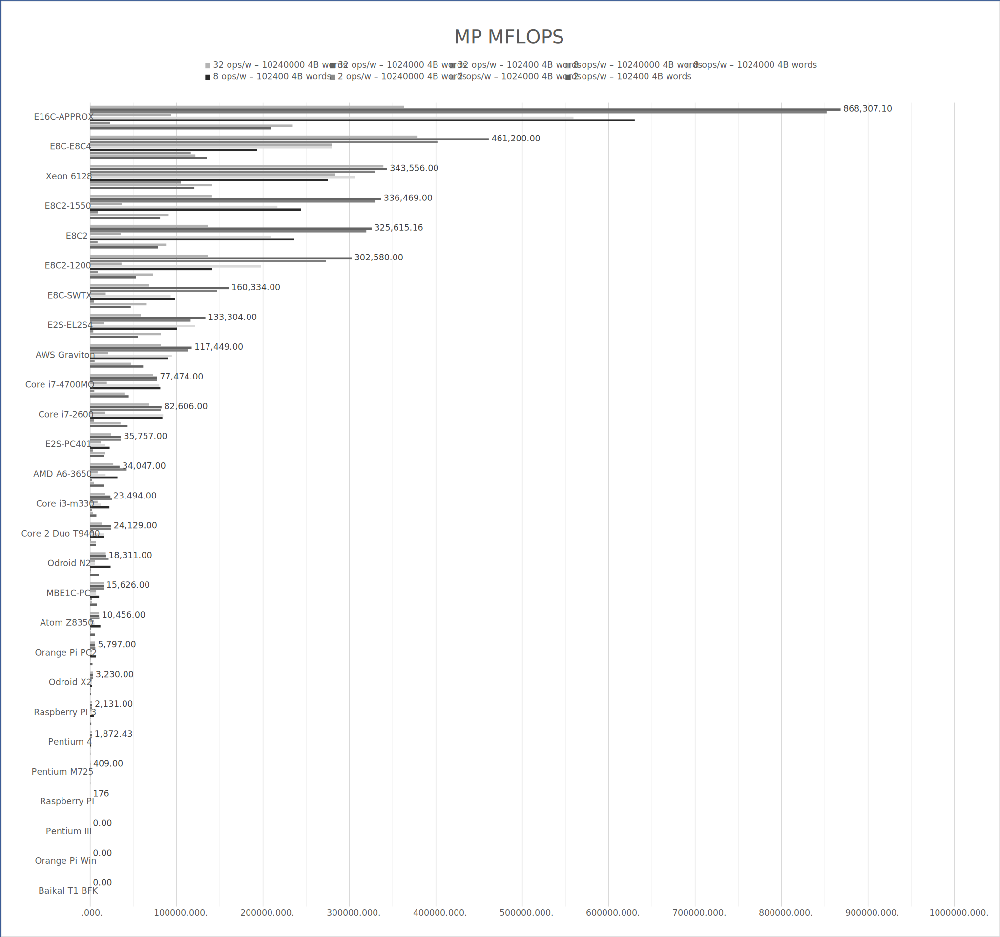

MP MFLOPS, все процессоры, 2 ops/w


MP MFLOPS, все процессоры, 8 ops/w
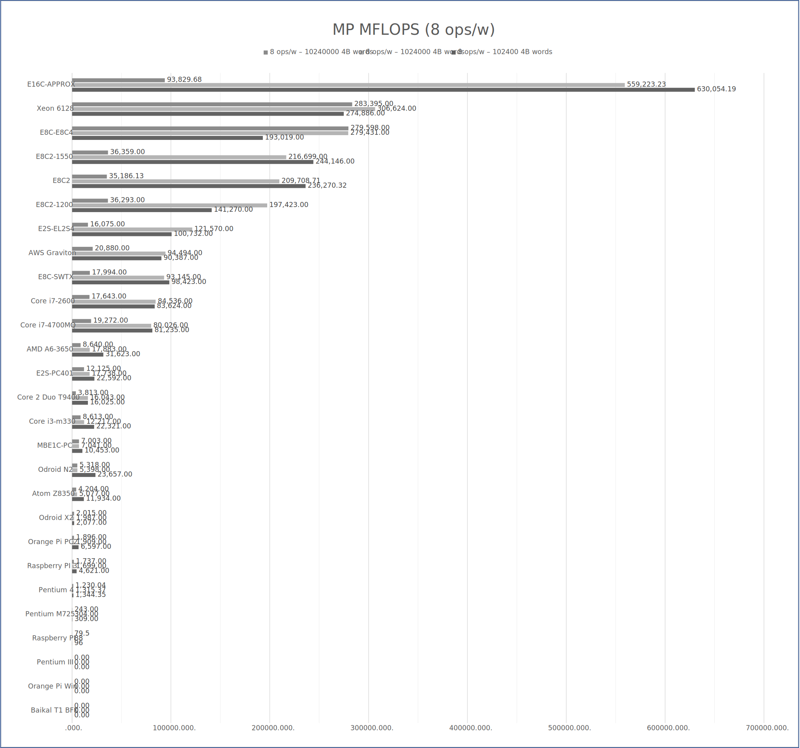

MP MFLOPS, все процессоры, 32 ops/w
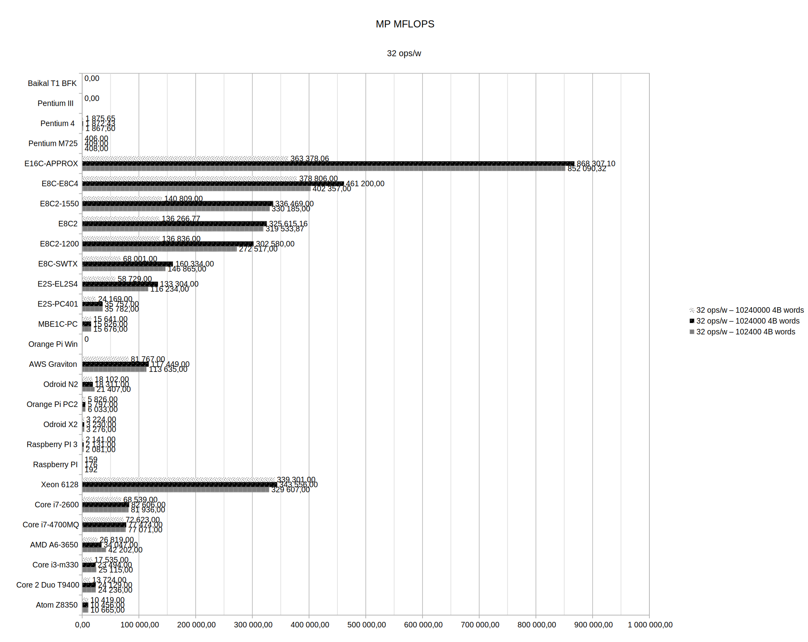


Вот здесь процессоры Эльбрус показывают свою превосходство над всеми другими архитектурами: способность выполнять большое число операций за так (архитектура VLIW).
Процессор 8СВ набирает 378 ГФлопс (Теоретически 576) на 32х операциях. Core i7-2600 - 82.6 ГФлопс.
Процессоры на ARM выдают всего 23.7 ГФлопс (Для Cortex A72, Odroid N2), AWS Graviton - 117 ГФлопс, за счёт 16ти ядер.

### Scimark 2 (однопоточный)


| Platform         | Composite Score | FFT      | SOR      | MonteCarlo | Sparse matmult | LU       | CPU                                              | Cores | Frequency (MHz) | Per MHz | Relative | Relative (MHz) | Architecture |
| ---------------- | --------------- | -------- | -------- | ---------- | -------------- | -------- | ------------------------------------------------ | ----- | --------------- | ------- | -------- | -------------- | ------------ |
| Xeon 6128        | 2 427,42        | 2 011,19 | 1 564,17 | 753,09     | 2 878,47       | 4 930,18 | Intel(R) Xeon(R) Gold 6128 CPU @ 3.40GHz (2 CPU) | 24    | 3400            | 0,71    | 1,17     | 0,83           | amd64        |
| Core i7-4700MQ   | 2 071,26        | 1 693,12 | 1 599,69 | 568,17     | 2 148,40       | 4 346,91 | Intel(R) Core(TM) i7-4700MQ CPU @ 2.40GHz        | 8     | 2400            | 0,86    | 1,00     | 1,00           | amd64        |
| Core i7-2600     | 1 800,00        | 1 517,97 | 1 636,33 | 515,34     | 1 981,74       | 3 348,64 | Intel(R) Core(TM) i7-2600 CPU @ 3.40GHz          | 8     | 3400            | 0,53    | 0,87     | 0,61           | amd64        |
| Core 2 Duo T9400 | 1 051,93        | 720,56   | 1 201,02 | 307,36     | 1 119,72       | 1 911,00 | Intel(R) Core(TM) 2 Duo CPU     T9400  @ 2.53GHz | 2     | 2530            | 0,42    | 0,51     | 0,48           | amd64        |
| Core i3-m330     | 1 002,61        | 759,27   | 967,15   | 290,85     | 933,71         | 2 062,08 | Intel(R) Core(TM) i3 CPU       M 330  @ 2.13GHz  | 4     | 2133            | 0,47    | 0,48     | 0,54           | amd64        |
| Atom Z8350       | 509,44          | 267,60   | 719,12   | 178,04     | 497,19         | 885,27   | Intel(R) Atom(TM) x5-Z8350 CPU @ 1.44GHz         | 4     | 1440            | 1,25    | 0,87     | 1,45           | amd64        |
| AMD A6-3650      | 1 028,44        | 775,83   | 989,81   | 344,97     | 1 272,17       | 1 759,44 | AMD A6-3650 APU with Radeon(tm) HD Graphics      | 4     | 2600            | 0,40    | 0,50     | 0,46           | amd64        |
| Orange Pi PC2    | 191,59          | 147,36   | 283,10   | 64,07      | 185,46         | 277,94   | Allwinner H5 (aarch64)                           | 4     | 1152            | 0,17    | 0,09     | 0,19           | aarch64      |
| Orange Pi Win    | 169,22          | 150,49   | 276,78   | 76,72      | 166,98         | 175,11   | Allwinner A64 (aarch64)                          | 4     | 1344            | 0,13    | 0,08     | 0,15           | aarch64      |
| E8C2-1550        | 472,24          | 266,7    | 501,81   | 84,95      | 304,82         | 1202,94  | Elbrus 8C2 (E8C2 1550 MHz)                       | 8     | 1550            | 0,30    | 0,23     | 0,35           | e2k          |
| E8C2-1200        | 469,46          | 212,71   | 446,05   | 118,25     | 166,34         | 1 403,94 | Elbrus 8C2 (Broken 8MB Cache 1.2 GHz)            | 8     | 1200            | 0,39    | 0,23     | 0,45           | e2k          |
| E8C-SWTX         | 511,43          | 235,71   | 481,74   | 132,23     | 186,18         | 1521,26  | Elbrus 8C (E8C-SWTX)                             | 8     | 1300            | 0,39    | 0,25     | 0,46           | e2k          |
| MBE1C-PC         | 379,23          | 174,82   | 364,42   | 97,02      | 132,92         | 1126,98  | Elbrus 1C+ (MBE1C-PC)                            | 1     | 985             | 0,39    | 0,18     | 0,45           | e2k          |


Scimark 2, однопоточные результаты, все процессоры
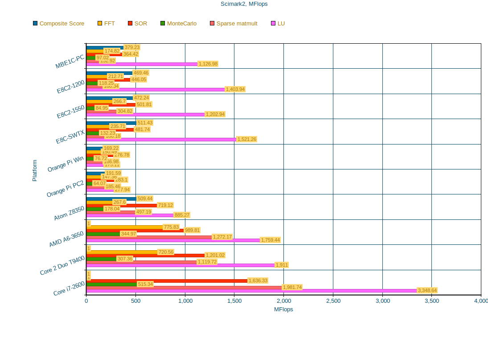

## Выводы

ARM процессоры уровня Cortex A9, Cortex A53 на уровне слабого Intel Atom, Pentium 4.
ARM процессоры уровня Cortex A72 уже приближаются к процессорам Intel Core.
Процессоры Эльбрус в основном быстрее процессоров ARM, но медленнее Intel Core из-за
маленькой тактовой частоты и могут работать намного быстрее, если программа под них хорошо оптимизированна,
но в будущем надеемся, что компилятор lcc будет ещё лучше доработан.

## P.S.

Спасибо команде из Телеграм чата: e2k_chat и людям с форума ixbt, которые помогли мне протестировать недостающие Эльбрусы.
Спасибо своим коллегам, которые предоставили мне некоторые одноплатные компьютеры на процессорах ARM.

Исходники тут и результаты : https://github.com/EntityFX/anybench
Не стесняйтесь, присылайте мне свои результаты.