## Предисловие

Попытка сравнить производительность процессоров на разнородных архитектурах x86-64, e2k (Эльбрус), mips и arm.
Все тесты написаны на языке C и компилируются под конкретную архитектуру с использованием конкретного компилятора для данной архитектуры и тесты производятся на различных дистрибутивах операционных систем на ядре Linux. На результаты может влиять как тип так и версия компилятора, а также режим оптимизаций. Хотя даже таким способом можно примерно сравнить производительность процессоров на разных архитектурах.


## Типы архитеткур сравниваемых процессоров

### CISC

CISC (Complex instruction set computing) - архитеткура, в которой небольшой набор регистров, команды различной длинны, операции кодируются одной командой.

### RISC

RISC (Reduced instruction set computing) - процессорная архитектура, в которой инструкции упрощены и имеют фиксированную длину (например, 32 бита), что позволяет повысить производительность. Имеет большое число регистров.

### VLIW

VLIW (very long instruction word) - архитектура процессоров с очень большой инструкцией. Одна инструкция содержит в себе много простых инструкций, которые могут исполняться разными блоками процессора. Всё это сильно упрощает архитектуру, но усложняет компилятор. Неэффективном коде может порождать не полностью заполненные инструкции, что сильно снижает производительность программы.

## Описание архитеткур сравниваемых процессоров

### x86 (ia32/x86/md64/EM64T/Intel/AMD)

x86 - [CISC](https://ru.wikipedia.org/wiki/CISC) архитектура, созданная компанией Intel, о которой знают все. Современный вариант архитектуры пошёл со времён 32 битного процессора Intel 386. Крупные игроки: Intel, AMD и VIA.

### ARM

ARM - [RISC](https://ru.wikipedia.org/wiki/RISC) архитектура разрабатываемая компанией [ARM Limited](https://ru.wikipedia.org/wiki/ARM_(%D0%BA%D0%BE%D0%BC%D0%BF%D0%B0%D0%BD%D0%B8%D1%8F)) с середины 80х годов. Текущие версии 32 битных ARM ядер: armv6 (ARM1136J(F)-S), armv7 (Cortex A9, Cortex A15), armv8 (CortexA53, CortexA57, Cortex A72 и выше). Процессоры данной архитектуры широко используются в мобильных телефонах, планшетах, встраиваемых устройствах, одноплатных компьютерах. Процессоры энергоэффективны и достаточно производительные.

### MIPS

MIPS - [RISC](https://ru.wikipedia.org/wiki/RISC) система команд и микропроцессорных архитектур, разработанных компанией MIPS Computer Systems. Процессоры данной архитектуры как и ARM используются в мобильных телефонах, планшетах, встраиваемых устройствах и т.д. Но почему-то больших объёмов устройств по сравнению с ARM она не достигла. Но процессоры на архитеткуре MIPS часто можно встретить в роутерах, ну и в медиапроигрывателях, а ещё она использовалась в процессоре приставки Play Station 1. Текущие реализации: 32 битная MIPS32 и 64 битная MIPS64.


### E2K (Elbrus 2000/Эльбрус)

[VLIW](https://ru.wikipedia.org/wiki/VLIW)

## Список бенчмарков

* [Dhrystone](https://ru.wikipedia.org/wiki/Dhrystone)
* [Whetstone](https://ru.wikipedia.org/wiki/Whetstone) 
* [LINPACK](https://ru.wikipedia.org/wiki/Linpack)
* [Coremark](https://ru.wikipedia.org/wiki/CoreMark)
* [Memspeed](http://www.roylongbottom.org.uk/memspd2k%20results.htm)
* [Livermore Loops](http://www.roylongbottom.org.uk/classic.htm)
* [MP MFLOPS](http://www.roylongbottom.org.uk/linux%20benchmarks.htm#anchor7)
* Scimark 2

### Dhrystone

> Dhrystone - синтетический тест, который был написан Reinhold P. Weicker в 1984 году.
> Данный тест не использует операции с плавающей запятой, а версия 2.1 написана так, чтобы исключить возможность сильных оптимизаций при компиляции.
> Бенчмарк выдаёт результаты в VAX Dhrystones в секунду, где 1 VAX DMIPS = Dhrystones в секунду делить на 1757.

### Whetstone

> Whetstone - синтетический тест, который был написан Harold Curnow в 1972 году на языке Fortran.
> Позже был переписан на языке C Roy Longbottom. Данный тест выдаёт результаты в MWIPS,
> также промежуточные результаты в MOPS (Миллионов операций в секунду) и MFLOPS (Миллионы вещественных операций с плавующей запятой в секунду).
> Данный тест производит различне подсчёты: производительность целочисленных и операций с плавующей запятой,
> производительность операций с массивами, с условным оператором, производительность тригонометрических функций и функций возвдения в степень, логарифмов и извлечения корня.

Также мной был написан тест Whetstone на языках JS (Для тестирования браузера и NodeJS) и C# (Для тестирования Mono, .Net Framework и Dotnet Core), а также я нашёл реализацию на Java.

> Whetstone MP - многопоточный вариант Whetstone.

### LINPACK

> LINPACK - тест, который был написан Jack Dongarra на языке Fortran в 70х годах, позже переписан на язык C.
> Тест считает ситемы линейных уравнений, делает различные операции над двумерными (матрицами) и одномерными (векторами).
> Используется реализация Linpack 100x100 с числами типа float. Реализация теста хорошо используется для оценки производительности
> различных суперкомпьютеров.

### Coremark

> Набор тестов написанных на языке C. Создан в 2009 году Shay Gal-On из компании EEMBC 
> Содержит реализации таких алгоритмов: обработка связных списков (поиск и сортировка), обработка матриц (несколько матричных операций), машина состояний (определение, что входной символьный поток содержит действительные числа в десятичной записи), подсчет суммы CRC.

### Memspeed

> Memspeed - выполняет 3 различные операции, над 64 битными числами с плавающей запятой двойной точности, 32 битными с плавающей запятой одинарной точности and 32 битными целыми над 2мя массивами:
> * Сумма с регистром   r = r + x [m] * y[m] (Integer + y [m])
> * Сумма в память      x[m] = x[m] + y[m]                    
> * Память в память     x[m] = y[m]  

### Livermore Loops

> тест для суперкомпьютеров, появился в 1970, изначально содержал 14 тестов на языке Fortran. Далее тестов было увеличено до 24 в 1980'е. Производительность измеряется в Миллионах Операций Чисел с Плавающей Точкой в Секунду или  MFLOPS. 
> тест проверяет точно вычислений в конце. Основная цель - избежать простых операций над чилами, 24 теста выполняются 3 раза в цикле Do-loop и вычисляют производительность на короткими, средними и большими последовательностями чисел.

### MP MFLOPS


### Scimark 2

> SciMark 2 - набор тестов на языке C измеряющий производительность кода встречающегося в научных и профессиональных приложениях. Содержит в себе 5 вычислительных тестов: FFT (быстрое преобразование Фурье), Gauss-Seidel relaxation (Метод Гаусса — Зейделя для решения СЛАУ), Sparse matrix-multiply (Умножение разреженных матриц), Monte Carlo integration (Интегрирование методом Монте-Карло), и LU factorization (LU-разложение).

## Участники

Стенды на процессорах x86 (i386) х86-64 (amd64):

* [Core i7-2600](https://ark.intel.com/content/www/us/en/ark/products/52213/intel-core-i7-2600-processor-8m-cache-up-to-3-80-ghz.html)
* [AMD A6-3650](http://www.cpu-world.com/CPUs/K10/AMD-A-Series%20A6-3650%20AD3650WNZ43GX%20(AD3650WNGXBOX).html)
* [Atom Z8350](https://ark.intel.com/content/www/us/en/ark/products/93361/intel-atom-x5-z8350-processor-2m-cache-up-to-1-92-ghz.html)
* [Core 2 Duo T9400](https://ark.intel.com/content/www/us/en/ark/products/35562/intel-core-2-duo-processor-t9400-6m-cache-2-53-ghz-1066-mhz-fsb.html)

Стенды на процессорах armv6 (armel), armv7 (armhf), armv8 (aarch64):

* [Odroid N2 (Amlogic S922X)](https://wiki.odroid.com/odroid-n2/hardware)
* Odroid X2 (Samsung Exynos 4412)
* [Orange Pi PC2 (Allwinner H5)](http://www.orangepi.org/orangepipc2/)
* [Orange Pi Win (Allwinner A64)](http://www.orangepi.org/OrangePiWinPlus/0)
* [Raspberry PI 3 (Broadcom BCM2837B0)](https://www.raspberrypi.org/products/raspberry-pi-3-model-b/)
* [Raspberry PI (Broadcom BCM2835)](https://www.raspberrypi.org/products/raspberry-pi-1-model-b-plus/)
* [AWS Graviton (Alpine AL73400)](https://en.wikichip.org/wiki/annapurna_labs/alpine/al73400)

Стенды на процессорах e2k (Elbrus 2000) (v3, v4, v5):

* [E8C-SWTX (Elbrus 8C)](http://www.mcst.ru/elbrus-8c)
* [E8C-E8C4 (Elbrus 8C x4 cpu)](http://www.ineum.ru/elbrus_804_1u0)
* [E8C2 (Elbrus 8C2) (1200 MHz, 1550 MHz)](http://www.mcst.ru/elbrus-8cb)
* [E2S-EL2S4 (Elbrus 4C x4 cpu)](м)s
* [E2S-PC401 (Elbrus 4C)](http://www.ineum.ru/vk-elbrus-401pc)
* [MBE1C-PC (Elbrus 1C+)](http://www.ineum.ru/elbrus_101-pc)

Стенды на процессорах MIPS :

* [Baikal T1 BFK](http://www.baikalelectronics.ru/products/35/) 

### Таблица со всеми участниками

| Стенд            | Модель процессора                               | Всего ядер (потоков) | Частота (МГц) | Архитектура |
| ---------------- | ----------------------------------------------- | -------------------- | ------------- | ----------- |
| Core i7-2600     | Intel(R) Core(TM) i7-2600 CPU @ 3.40GHz         | 8 (4/8)              | 3,400.00      | amd64       |
| Core 2 Duo T9400 | Intel(R) Core(TM) 2 Duo CPU    T9400  @ 2.53GHz | 2                    | 2,530.00      | amd64       |
| AMD A6-3650      | AMD A6-3650 APU with Radeon(tm) HD Graphics     | 4                    | 2,600.00      | amd64       |
| Atom Z8350       | Intel(R) Atom(TM) x5-Z8350 CPU @ 1.44GHz        | 4                    | 1,440.00      | amd64       |
| Raspberry PI     | Broadcom BCM2835                                | 1                    | 700.00        | amd64       |
| AWS Graviton     | Alpine AL73400                                  | 16                   | 2,300.00      | arm         |
| Odroid N2        | Amlogic S922X                                   | 6                    | 1,800.00      | arm         |
| Odroid X2        | Samsung Exynos 4412 (armv7l)                    | 4                    | 1,700.00      | arm         |
| Orange Pi PC2    | Allwinner H5 (aarch64)                          | 4                    | 1,152.00      | arm         |
| Raspberry PI 3   | Broadcom BCM2837B0 (armv8)                      | 4                    | 1,200.00      | arm         |
| Orange Pi Win    | Allwinner A64 (aarch64)                         | 4                    | 1,344.00      | arm         |
| E8C-SWTX         | Elbrus 8C (E8C-SWTX)                            | 8                    | 1,300.00      | e2k         |
| E8C-E8C4         | Elbrus 8C (4 CPU)                               | 32 (8 x 4 cpu)       | 1,300.00      | e2k         |
| E8C2-1550        | Elbrus 8C2 (E8C2)                               | 8                    | 1,550.00      | e2k         |
| E8C2-1200        | Elbrus 8C2 (E8C2)                               | 8                    | 1,200.00      | e2k         |
| E2S-EL2S4        | Elbrus 4C (EL2S4) (4 CPU)                       | 16 (4 x 4 cpu)       | 750.00        | e2k         |
| E2S-PC401        | Elbrus 4C (E2S) (pc401)                         | 4                    | 800.00        | e2k         |
| MBE1C-PC         | Elbrus 1C+ (MBE1C-PC)                           | 1                    | 985.00        | e2k         |
| Pentium 4        | Intel(R) Pentium(TM) 4 CPU                      | 1                    | 3,066.00      | i386        |
| Pentium III      | Intel(R) Pentium(TM) III CPU                    | 1                    | 1,000.00      | i386        |
| Baikal T1 BFK    | Baikal-T1 (MIPS P5600 V3.0)                     | 2                    | 1,200.00      | mips        |

## Настройки компиляторов

## Результаты тестов

### Dhrystone


Таблица с результатами Dhrystone в 1 поток:

| Стенд            | Dhrystones (VAX MIPS rating) | Частота (MHz) | Dhrystone / 1 MHz | Относительно Core i7-2600 | Относительно Core i7-2600 / 1 MHz |
| ---------------- | ---------------------------- | ------------- | ----------------- | ------------------------- | --------------------------------- |
| Core i7-2600     | **22076,97**                    | 3400          | 6,49              | 1,00                      | 1,00                              |
| Core 2 Duo T9400 | **13308,91**                    | 2530          | 5,26              | 0,60                      | 0,81                              |
| AMD A6-3650      | **11455,81**                    | 2600          | 4,41              | 0,52                      | 0,68                              |
| Atom Z8350       | **4677,30**                    | 1440          | 3,25              | 0,21                      | 0,50                              |
| Raspberry PI     | **847,00**                    | 700           | 1,21              | 0,04                      | 0,19                              |
| AWS Graviton     | **11377,63**                    | 2300          | 4,95              | 0,52                      | 0,76                              |
| Odroid N2        | **8230,00**                    | 1800          | 4,57              | 0,37                      | 0,70                              |
| Odroid X2        | **4495,03**                    | 1700          | 2,64              | 0,20                      | 0,41                              |
| Orange Pi PC2    | **2949,12**                    | 1152          | 2,56              | 0,13                      | 0,39                              |
| Raspberry PI 3   | **2469,00**                    | 1200          | 2,06              | 0,11                      | 0,32                              |
| Orange Pi Win    | **2370,00**                    | 1344          | 1,76              | 0,11                      | 0,27                              |
| E8C-SWTX         | **5865,19**                    | 1300          | 4,51              | 0,27                      | 0,69                              |
| E8C-E8C4         | **5844,82**                    | 1300          | 4,50              | 0,26                      | 0,69                              |
| E8C2             | **5357,45**                    | 1550          | 3,57              | 0,24                      | 0,55                              |  |  |
| E8C2-1200        | **3554,46**                    | 1200          | 2,96              | 0,16                      | 0,46                              |
| E2S-EL2S4        | **3329,51**                    | 750           | 4,44              | 0,15                      | 0,68                              |
| E2S-PC401        | **3548,80**                    | 800           | 4,44              | 0,16                      | 0,68                              |
| MBE1C-PC         | **4302,53**                    | 985           | 4,37              | 0,19                      | 0,67                              |
| Pentium 4        | **4012,00**                    | 3066          | 1,31              | 0,18                      | 0,20                              |
| Pentium III      | **1595,00**                    | 1000          | 1,60              | 0,07                      | 0,25                              |
| Baikal T1 BFK    | **3650,00**                    | 1200          | 3,04              | 0,17                      | 0,47                              |

Dhrystone, все процессоры:
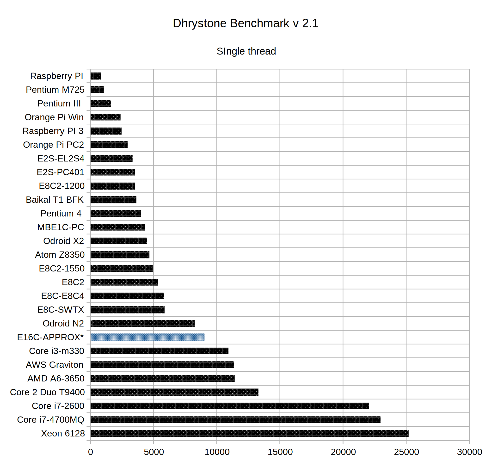

Dhrystone, x86-64 и e2k процессоры:
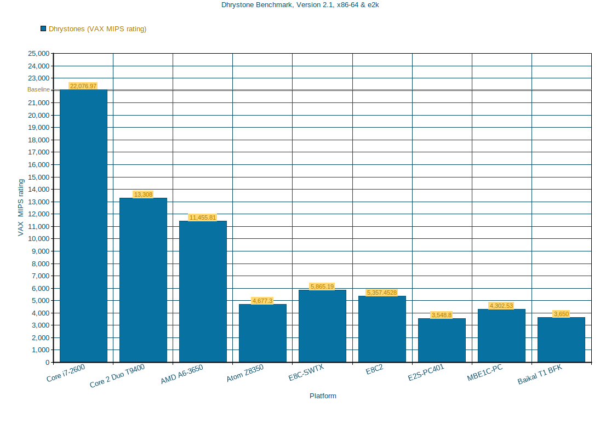

Здесь видно, что в тесте Dhrystone процессоры x86 заметно быстрее arm и Эльбрус процессоров. Производительность 1 ядра Эльбрус 8С (E8C) сравнима с ядром Cortex A72 на 1 МГц, Эльбрус 8С чуть быстрее Atom Z8350 на 1 МГц. Производительность Baikal T1 сравнима с ядром Arm Cortex A9. Странно себя показал Эльбрус 8СВ, котороый с большой частотой оказался медленнее Эльбрус 8С. В МЦСт мне ответили, что экземпляр тестовый и компилятор немного не доработан под данную версию, возможно с другим экземпляром тесты окажутся гораздо лучше.


### Whetsone

| Стенд            | MWIPS   | MWIPS (multicore) | Ядра (потоки) | Частота (MHz) | MWIPS / 1 MHz / Ядро | MWIPS / 1 MHz | Относительно Core  i7-2600 на 1 поток | Относительно  Core i7-2600 | Относительно  Core i7-2600 на 1 поток / 1 MHz | Относительно  Core i7-2600 / 1 MHz |
|------------------|---------|-------------------|---------------|---------------|----------------------|---------------|---------------------------------------|----------------------------|-----------------------------------------------|------------------------------------|
| Core i7-2600     | **5729.52** | 31319.00          | 8             | 3400          | 1.69                 | 9.21          | 1.00                                  | 1.00                       | 1.00                                          | 1.00                               |
| Core 2 Duo T9400 | **2910.33** | 5195.00           | 2             | 2530          | 1.15                 | 2.05          | 0.51                                  | 0.17                       | 0.68                                          | 0.22                               |
| AMD A6-3650      | 3718.16** | 12113.00          | 4             | 2600          | 1.43                 | 4.66          | 0.65                                  | 0.39                       | 0.85                                          | 0.51                               |
| Atom Z8350       | 2085.24** | 6636.00           | 4             | 1440          | 1.45                 | 4.61          | 0.36                                  | 0.21                       | 0.86                                          | 0.50                               |
| Raspberry PI     | 270.50**  | 270.50            | 1             | 700           | 0.39                 | 0.39          | 0.05                                  | 0.01                       | 0.23                                          | 0.04                               |
| AWS Graviton     | 2851.80** | 44741.00          | 16            | 2300          | 1.24                 | 19.45         | 0.50                                  | 1.43                       | 0.73                                          | 2.11                               |
| Odroid N2        | 2136.98 | 9931.00           | 6             | 1800          | 1.19                 | 5.52          | 0.37                                  | 0.32                       | 0.70                                          | 0.60                               |
| Odroid X2        | 1305.16 | 4291.00           | 4             | 1700          | 0.77                 | 2.52          | 0.23                                  | 0.14                       | 0.45                                          | 0.27                               |
| Orange Pi PC2    | 980.26  | 3798.00           | 4             | 1152          | 0.85                 | 3.30          | 0.17                                  | 0.12                       | 0.50                                          | 0.36                               |
| Raspberry PI 3   | 997.20  | 2779.80           | 4             | 1200          | 0.83                 | 2.32          | 0.17                                  | 0.09                       | 0.49                                          | 0.25                               |
| Orange Pi Win    | 700.60  | 1854.00           | 4             | 1344          | 0.52                 | 1.38          | 0.12                                  | 0.06                       | 0.31                                          | 0.15                               |
| E8C-SWTX         | 1517.62 | 12980.00          | 8             | 1300          | 1.17                 | 9.98          | 0.26                                  | 0.41                       | 0.69                                          | 1.08                               |
| E8C-E8C4         | 1647.51 | 53563.00          | 32            | 1300          | 1.27                 | 41.20         | 0.29                                  | 1.71                       | 0.75                                          | 4.47                               |
| E8C2             | 1703.75 | 14571.94          | 8             | 1500          | 1.14                 | 9.71          | 0.30                                  | 0.47                       | 0.67                                          | 1.05                               |
| E8C2-APPROX      | 1932.40 | 31050.00          | 8             | 1500          | 1.29                 | 20.70         | 0.34                                  | 0.99                       | 0.76                                          | 2.25                               |
| E16C-APPROX      | 2576.53 | 20869.87          | 16            | 2000          | 1.29                 | 10.43         | 0.45                                  | 0.67                       | 0.76                                          | 1.13                               |
| E8C2-LOW         | 1545.92 | 12420.00          | 8             | 1200          | 1.29                 | 10.35         | 0.27                                  | 0.40                       | 0.76                                          | 1.12                               |
| E2S-EL2S4        | 970.80  | 15790.00          | 16            | 750           | 1.29                 | 21.05         | 0.17                                  | 0.50                       | 0.77                                          | 2.29                               |
| E2S-PC401        | 938.12  | 2455.00           | 4             | 800           | 1.17                 | 3.07          | 0.16                                  | 0.08                       | 0.69                                          | 0.33                               |
| MBE1C-PC         | 1277.55 | 1312.00           | 1             | 985           | 1.30                 | 1.33          | 0.22                                  | 0.04                       | 0.77                                          | 0.14                               |
| Pentium 4        | 1119.00 | 1119.00           | 1             | 3066          | 0.36                 | 0.36          | 0.20                                  | 0.04                       | 0.22                                          | 0.04                               |
| Pentium III      | 816.00  | 816.00            | 1             | 1000          | 0.82                 | 0.82          | 0.14                                  | 0.03                       | 0.48                                          | 0.09                               |
| Baikal T1 BFK    | 613.50  | 1227.00           | 2             | 1200          | 0.51                 | 1.02          | 0.11                                  | 0.04                       | 0.30                                          | 0.11                               |


Whetstone Single Precision, все процессоры
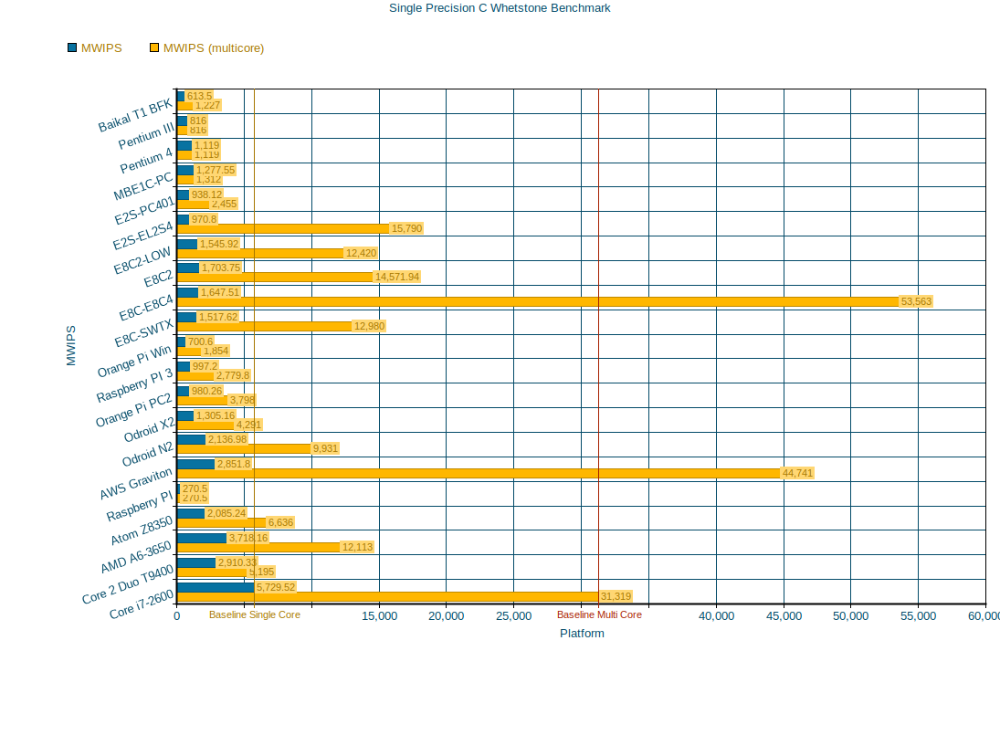

Whetstone Single Precision, x86-64 и e2k процессоры
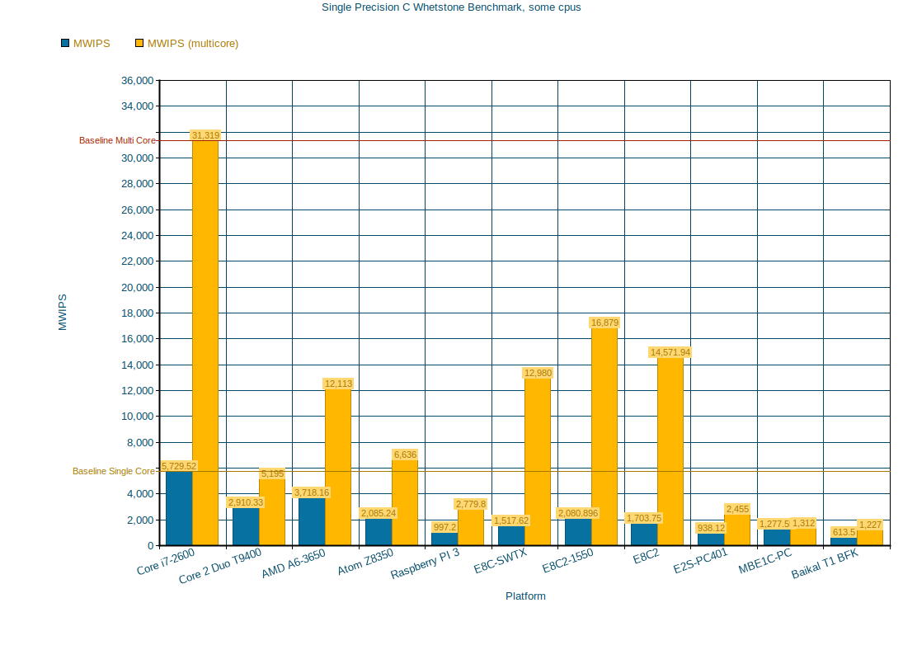

Whetstone Single Precision, однопоточные результаты, x86-64 и e2k процессоры
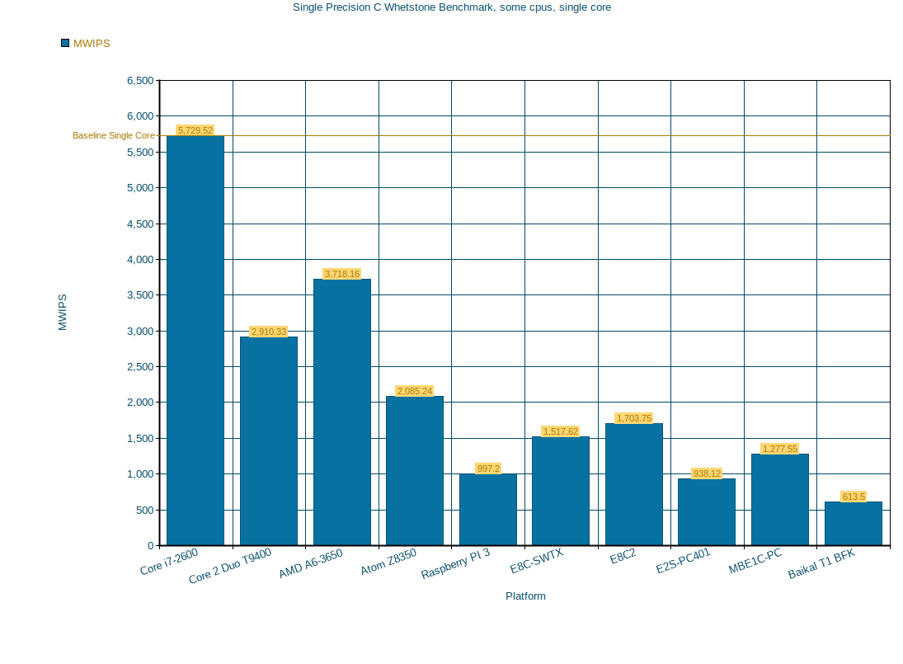

Whetstone Single Precision, многопоточные результаты, x86-64 и e2k процессоры
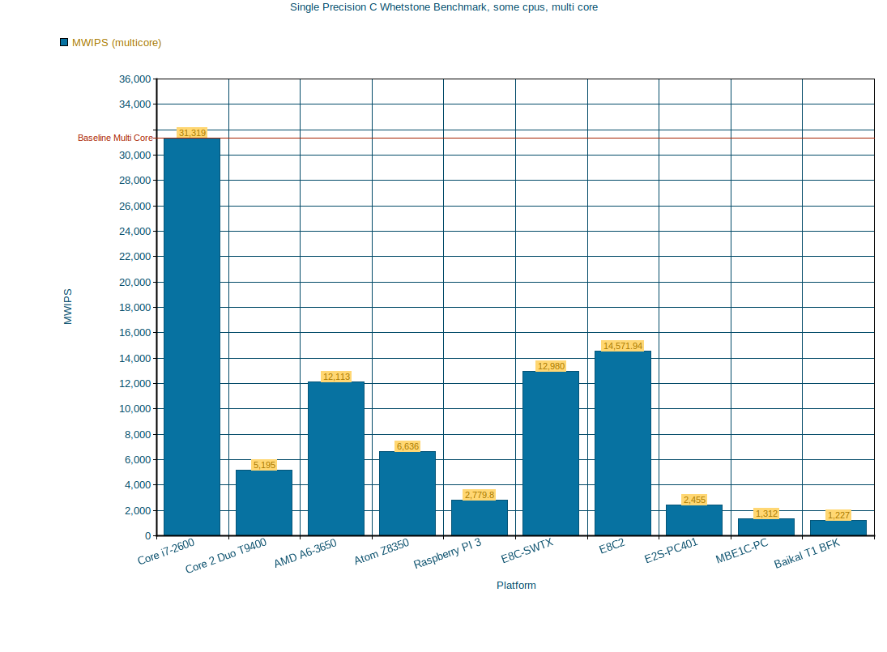

### LINPACK

| Platform         | Mflops    |
| ---------------- | --------- |
| Core i7-2600     | 4302.89   |
| Core 2 Duo T9400 | 1816.02   |
| AMD A6-3650      | 1750.03   |
| Atom Z8350       | 1021.44   |
| Raspberry PI     | 42        |
| AWS Graviton     | 1548.65   |
| Odroid N2        | 845.09    |
| Odroid X2        | 268.73    |
| Orange Pi PC2    | 163.44    |
| Raspberry PI 3   | 180       |
| Orange Pi Win    | 174.04    |
| E8C-SWTX         | 1075.27   |
| E8C-E8C4         | 1089.02   |
| E8C2-1550        | 1257.2375 |
| E8C2-1200        | 1005.79   |
| E2S-EL2S4        | 632.51    |
| E2S-PC401        | 674.67    |
| MBE1C-PC         | 814.76    |
| Pentium 4        | 840.27    |
| Pentium III      | 316.67    |


LINPACK 100x100 Double Precision, все процессоры


### Coremark

| Platform         | Coremark (single thread) | Coremark (multi thread) |
| ---------------- | ------------------------ | ----------------------- |
| Core i7-2600     | 22692.889561             | 119670.905011           |
| Core 2 Duo T9400 | 12481.278083             | 23950.661637            |
| AMD A6-3650      | 11810.558639             | 41666.666667            |
| Atom Z8350       | 6893.094373              | 23814.678502            |
| Raspberry PI     | 1303.78                  | 1303.78                 |
| Odroid X2        | 6109.074753              | 24162.548051            |
| Orange Pi PC2    | 3869.719445              | 14901.279026            |
| Raspberry PI 3   | 3841                     | 15363.93                |
| Orange Pi Win    | 3840.983292              | 15370.821058            |
| E8C-SWTX         | 3711                     | 28846.153846            |
| E8C-E8C4         | 3813.640119              | 117885.430096           |
| E8C2-1550        | 4266.7                   | 33165.69                |
| E8C2-1200        | 3413.357606              | 26396.83238             |
| E2S-EL2S4        | 2216.475803              | 34457.87231474          |
| E2S-PC401        | 2364.24                  | 36755.06                |
| MBE1C-PC         | 2901.49427               | 2848.318157             |
| Pentium 4        | 5941.45                  | 5941.45                 |
| Pentium III      | 2246.570438799           | 2246.570438799          |
| Baikal T1        | 6182                     | 12364                   |


Coremark, все процессоры
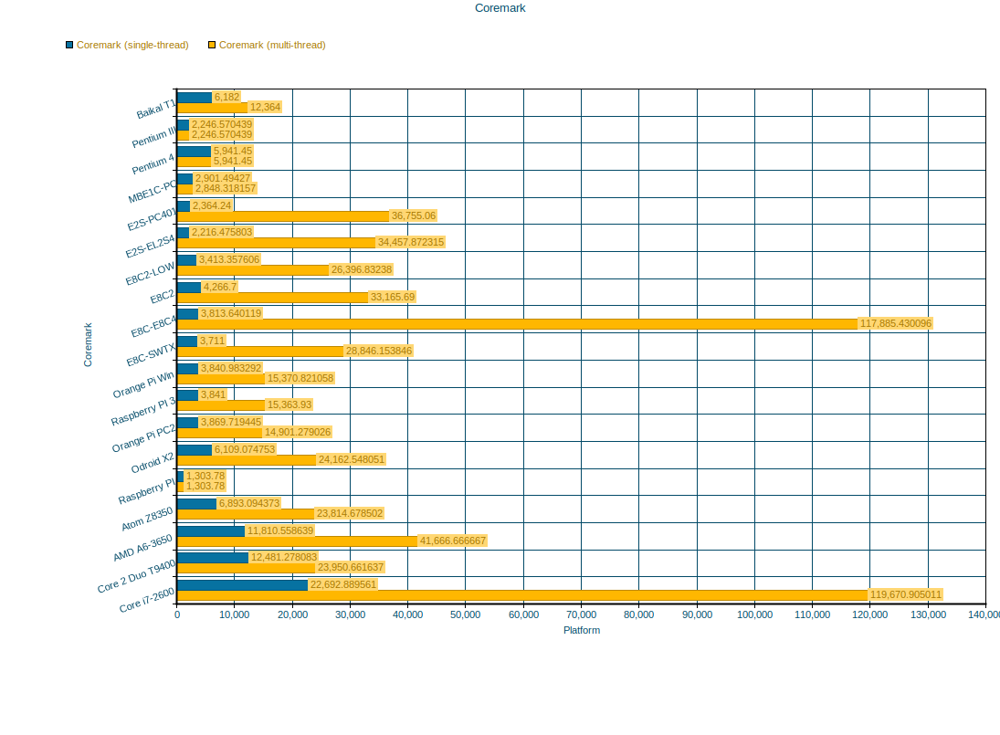

Coremark, однопоточные результаты, все процессоры
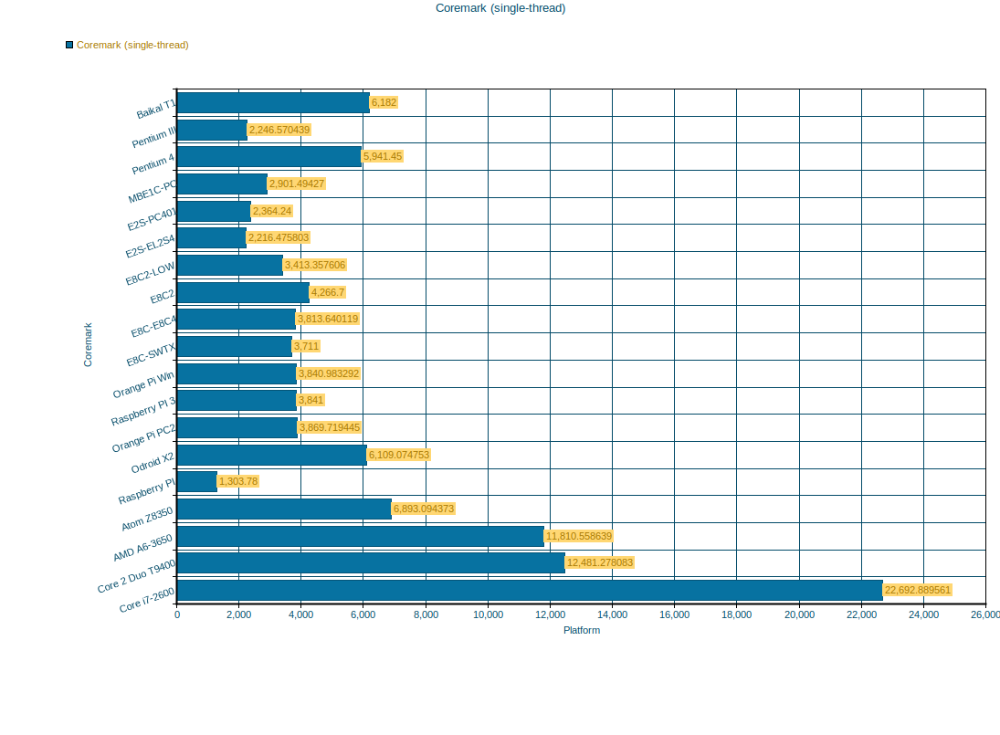

Coremark, многопоточные результаты, все процессоры
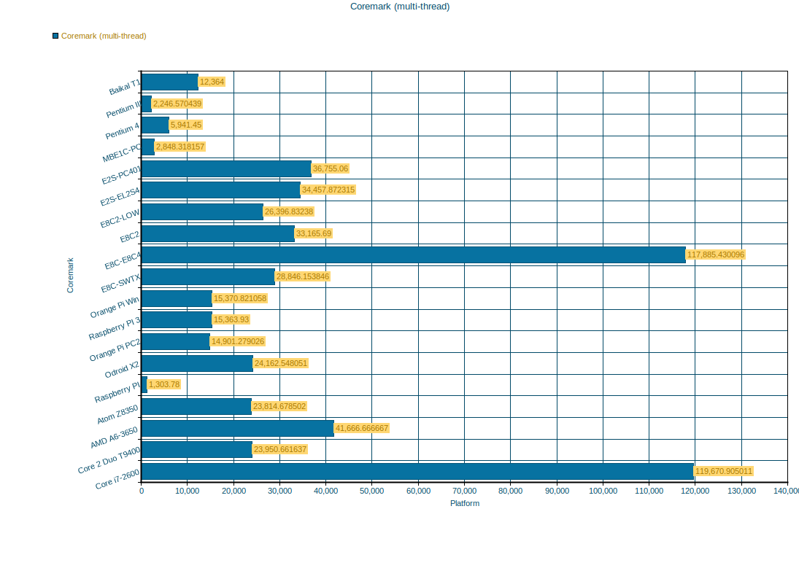

### Memspeed

```c
(x[i] = x[i] + a * y[i])
```

```c
(x[i] = x[i] + y[i])
```

```c
(x[i] = y[i])
```


| Platform         | 16 KB `(x[i] = x[i] + a * y[i])` | 512 KB `(x[i] = x[i] + a * y[i])` | 8192 KB `(x[i] = x[i] + a * y[i])` | 16 KB `(x[i] = x[i] + y[i])` | 512 KB `(x[i] = x[i] + y[i])` | 8192 KB `(x[i] = x[i] + y[i])` | 16 KB `(x[i] = y[i])` | 512 KB `(x[i] = y[i])` | 8192 KB `(x[i] = y[i])` |
| ---------------- | -------------------------------- | --------------------------------- | ---------------------------------- | ---------------------------- | ----------------------------- | ------------------------------ | --------------------- | ---------------------- | ----------------------- |
| Core i7-2600     | 73499                            | 53366                             | 32794                              | 75334                        | 54605                         | 32432                          | 26348                 | 16541                  | 8317                    |
| Core 2 Duo T9400 | 9737                             | 14189                             | 8249                               | 18113                        | 9344                          | 8153                           | 3232                  | 5196                   | 2131                    |
| AMD A6-3650      | 40930                            | 37749                             | 8578                               | 40988                        | 36529                         | 8523                           | 13655                 | 9154                   | 2154                    |
| Raspberry PI     | 602                              | 127                               | 127                                | 731                          | 127                           | 127                            | 426                   | 111                    | 111                     |
| AWS Graviton     | 21353                            | 17418                             | 7336                               | 7344                         | 18328                         | 21796                          | 12118                 | 12120                  | 4422                    |
| Odroid N2        | 8452                             | 8214                              | 3888                               | 9876                         | 8463                          | 3966                           | 8261                  | 7260                   | 3582                    |
| Odroid X2        | 2403                             | 1464                              | 1261                               | 2543                         | 1472                          | 1271                           | 3856                  | 1324                   | 627                     |
| Orange Pi PC2    | 3490                             | 1224                              | 1039                               | 2872                         | 1179                          | 1009                           | 4902                  | 2284                   | 1261                    |
| Raspberry PI 3   | 1814                             | 1598                              | 1019                               | 2240                         | 1906                          | 954                            | 3136                  | 2783                   | 871                     |
| Orange Pi Win    | 2672                             | 1752                              | 1019                               | 2771                         | 1787                          | 1028                           | 3483                  | 3146                   | 1374                    |
| E8C-SWTX         | 37160                            | 29195                             | 24130                              | 37806                        | 29193                         | 24114                          | 19096                 | 17431                  | 14045                   |
| E8C-E8C4         | 35377                            | 27882                             | 23315                              | 35758                        | 27681                         | 23172                          | 18273                 | 16898                  | 13798                   |
| E8C2-1550        | 41032                            | 41708                             | 33881                              | 19815                        | 12399                         | 9617                           | 6124                  | 4376                   | 3318                    |
| E8C2-1200        | 29062                            | 34168                             | 28890                              | 30016                        | 34232                         | 28920                          | 16709                 | 18654                  | 17513                   |
| E2S-EL2S4        | 20404                            | 22714                             | 7975                               | 20662                        | 23032                         | 7809                           | 10535                 | 11483                  | 4263                    |
| E2S-PC401        | 20721                            | 22106                             | 8491                               | 10053                        | 6591                          | 2092                           | 8415                  | 6145                   | 1468                    |
| MBE1C-PC         | 28070                            | 31305                             | 5856                               | 10999                        | 11421                         | 9663                           | 5073                  | 10442                  | 1163                    |


Memspeed, Умножение-сложение с присвоением, все процессоры
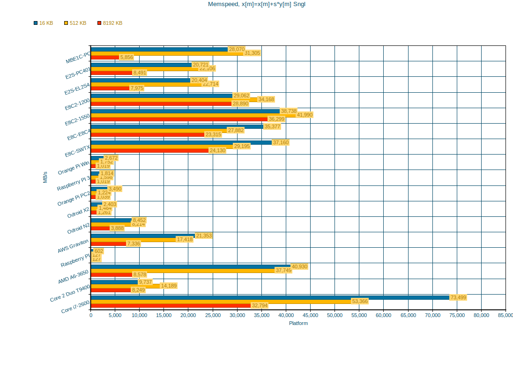

Memspeed, Сложение с присвоением, все процессоры
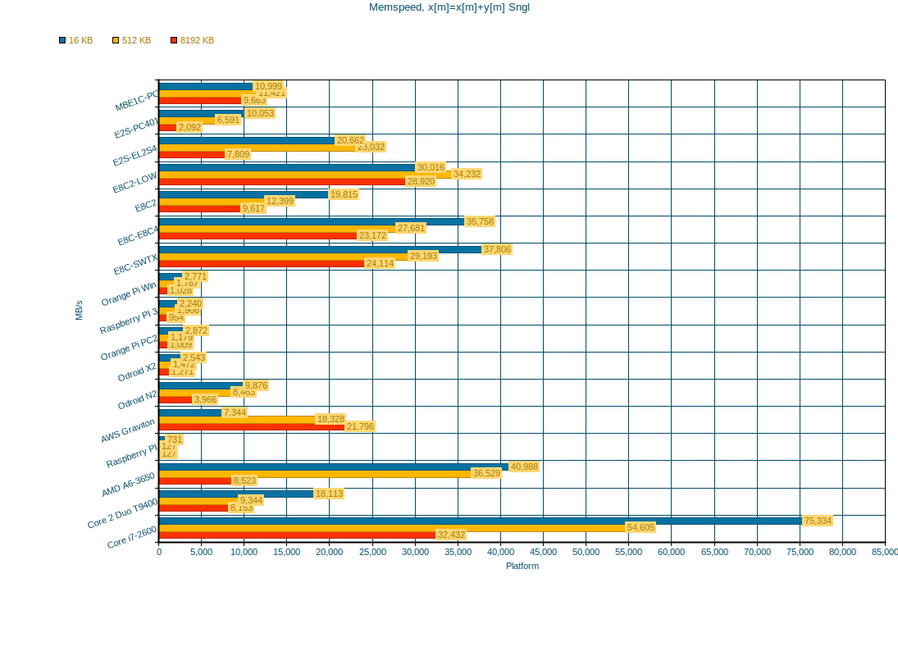

Memspeed, Присвоение, все процессоры
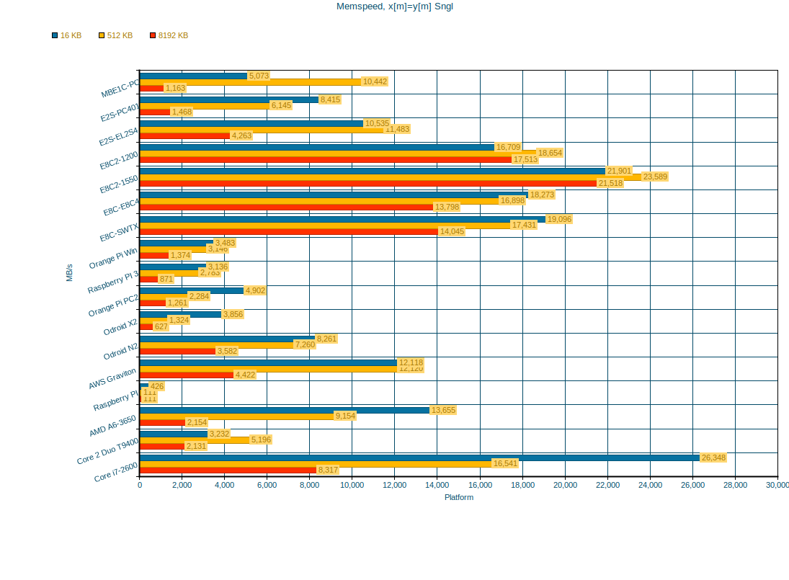

### MP MFLOPS

2 операции
```c
x[i] = (x[i]+a)*b;
```

8 операций
```c
x[i] = (x[i]+a)*b-(x[i]+c)*d+(x[i]+e)*f;
```

32 операции
```c
x[i] = (x[i]+a)*b-(x[i]+c)*d+(x[i]+e)*f-(x[i]+g)*h+(x[i]+j)*k-(x[i]+l)*m+(x[i]+o)*p-(x[i]+q)*r+(x[i]+s)*t-(x[i]+u)*v+(x[i]+w)*y;
```

| Platform         | 2 ops/w – 102400 4B words | 2 ops/w – 1024000 4B words | 2 ops/w – 10240000 4B words | 8 ops/w – 102400 4B words | 8 ops/w – 1024000 4B words | 8 ops/w – 10240000 4B words | 32 ops/w – 102400 4B words | 32 ops/w – 1024000 4B words | 32 ops/w – 10240000 4B words |
| ---------------- | ------------------------- | -------------------------- | --------------------------- | ------------------------- | -------------------------- | --------------------------- | -------------------------- | --------------------------- | ---------------------------- |
| Core i7-2600     | 43,309.00                 | 35,180.00                  | 4,454.00                    | 83,624.00                 | 84,536.00                  | 17,643.00                   | 81,936.00                  | 82,606.00                   | 68,539.00                    |
| Core 2 Duo T9400 | 6,614.00                  | 6,501.00                   | 949.00                      | 16,025.00                 | 16,043.00                  | 3,813.00                    | 24,236.00                  | 24,129.00                   | 13,724.00                    |
| AMD A6-3650      | 16,325.00                 | 4,294.00                   | 2,226.00                    | 31,623.00                 | 17,883.00                  | 8,640.00                    | 42,202.00                  | 34,047.00                   | 26,819.00                    |
| Atom Z8350       | 5,725.00                  | 1,303.00                   | 1,052.00                    | 11,934.00                 | 5,077.00                   | 4,204.00                    | 10,665.00                  | 10,456.00                   | 10,419.00                    |
| AWS Graviton     | 61,397.00                 | 47,660.00                  | 5,169.00                    | 90,387.00                 | 94,494.00                  | 20,880.00                   | 113,635.00                 | 117,449.00                  | 81,767.00                    |
| Odroid N2        | 9,859.00                  | 1,360.00                   | 1,328.00                    | 23,657.00                 | 5,398.00                   | 5,318.00                    | 21,407.00                  | 18,311.00                   | 18,102.00                    |
| Odroid X2        | 893.00                    | 598.00                     | 620.00                      | 2,077.00                  | 1,987.00                   | 2,015.00                    | 3,276.00                   | 3,230.00                    | 3,224.00                     |
| Orange Pi PC2    | 2,737.00                  | 482.00                     | 475.00                      | 6,597.00                  | 1,909.00                   | 1,896.00                    | 6,033.00                   | 5,797.00                    | 5,826.00                     |
| Raspberry PI 3   | 1,375.00                  | 441.00                     | 435.00                      | 4,621.00                  | 1,699.00                   | 1,737.00                    | 2,081.00                   | 2,131.00                    | 2,141.00                     |
| E8C-SWTX         | 46,965.00                 | 65,423.00                  | 4,505.00                    | 98,423.00                 | 93,145.00                  | 17,994.00                   | 146,865.00                 | 160,334.00                  | 68,001.00                    |
| E8C-E8C4         | 134,841.00                | 121,759.00                 | 116,454.00                  | 193,019.00                | 279,431.00                 | 279,598.00                  | 402,357.00                 | 461,200.00                  | 378,806.00                   |
| E8C2-1550        | 66,331.25                 | 91,061.25                  | 11,448.75                   | 176,587.50                | 246,778.75                 | 45,366.25                   | 340,646.25                 | 378,225.00                  | 171,045.00                   |
| E8C2-APPROX      | 69,156.25                 | 102,478.75                 | 4,632.50                    | 125,915.00                | 151,962.50                 | 20,093.75                   | 145,292.50                 | 166,630.00                  | 73,411.25                    |
| E16C-APPROX      | 144,507.69                | 201,301.54                 | 13,861.54                   | 302,840.00                | 286,600.00                 | 55,366.15                   | 451,892.31                 | 493,335.38                  | 209,233.85                   |
| E8C2-LOW         | 53,065.00                 | 72,849.00                  | 9,159.00                    | 141,270.00                | 197,423.00                 | 36,293.00                   | 272,517.00                 | 302,580.00                  | 136,836.00                   |
| E2S-EL2S4        | 55,325.00                 | 81,983.00                  | 3,706.00                    | 100,732.00                | 121,570.00                 | 16,075.00                   | 116,234.00                 | 133,304.00                  | 58,729.00                    |
| E2S-PC401        | 16,319.00                 | 17,495.00                  | 2,998.00                    | 22,592.00                 | 17,738.00                  | 12,125.00                   | 35,782.00                  | 35,757.00                   | 24,169.00                    |
| MBE1C-PC         | 7,804.00                  | 2,103.00                   | 2,089.00                    | 10,453.00                 | 7,041.00                   | 7,003.00                    | 15,676.00                  | 15,626.00                   | 15,641.00                    |
| Pentium 4        | 355.81                    | 360.64                     | 328.44                      | 1,344.35                  | 1,315.37                   | 1,230.04                    | 1,867.60                   | 1,872.43                    | 1,875.65                     |


MP MFLOPS, 2 операции, все процессоры
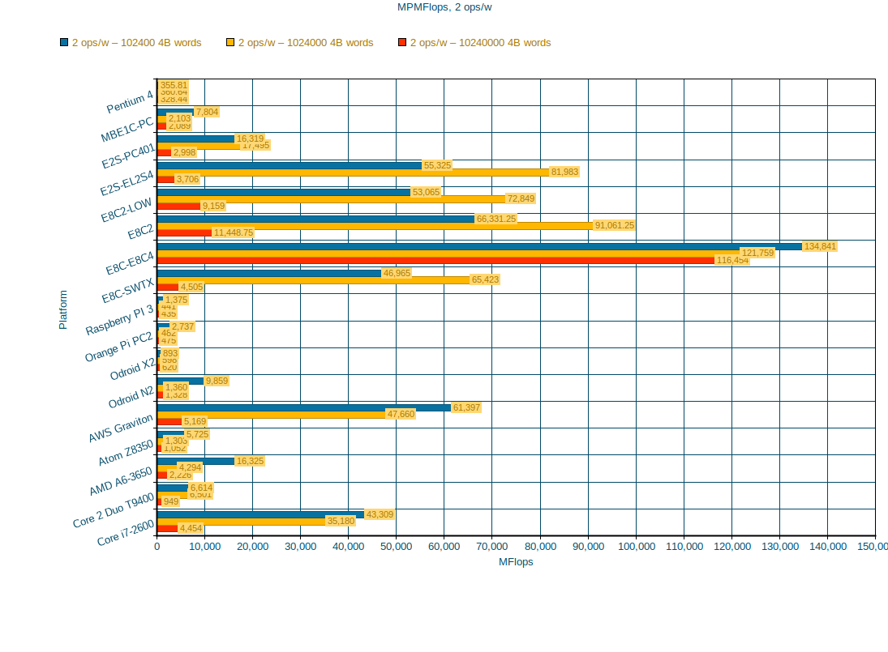

MP MFLOPS, 8 операций, все процессоры
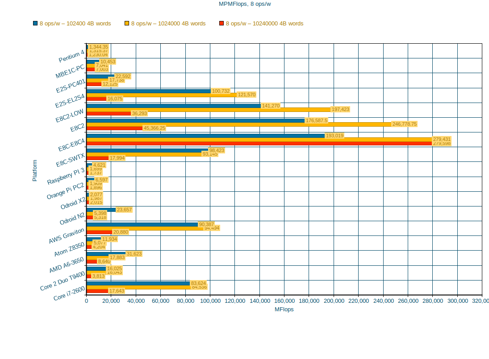

MP MFLOPS, 32 операции, все процессоры


### Scimark 2


| Platform         | Composite Score | FFT      | SOR     | MonteCarlo | Sparse matmult | LU      |
| ---------------- | --------------- | -------- | ------- | ---------- | -------------- | ------- |
| Core i7-2600     | 1 800,00        | 1 517,97 | 1636,33 | 515,34     | 1981,74        | 3348,64 |
| Core 2 Duo T9400 | 1 051,93        | 720,56   | 1201,02 | 307,36     | 1119,72        | 1911,00 |
| AMD A6-3650      | 1 028,44        | 775,83   | 989,81  | 344,97     | 1272,17        | 1759,44 |
| Atom Z8350       | 509,44          | 267,60   | 719,12  | 178,04     | 497,19         | 885,27  |
| Orange Pi PC2    | 191,59          | 147,36   | 283,10  | 64,07      | 185,46         | 277,94  |
| Orange Pi Win    | 169,22          | 150,49   | 276,78  | 76,72      | 166,98         | 175,11  |
| E8C-SWTX         | 511,43          | 235,71   | 481,74  | 132,23     | 186,18         | 1521,26 |
| E8C2-1550        | 472,24          | 266,7    | 501,81  | 84,95      | 304,82         | 1202,94 |
| E8C2-1200        | 469,46          | 212,71   | 446,05  | 118,25     | 166,34         | 1403,94 |
| MBE1C-PC         | 379,23          | 174,82   | 364,42  | 97,02      | 132,92         | 1126,98 |

Scimark 2, однопоточные результаты, x86-64 и e2k процессоры


## Выводы